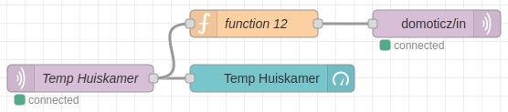
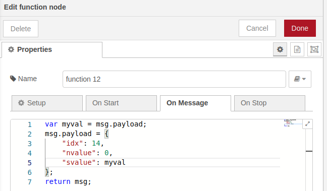
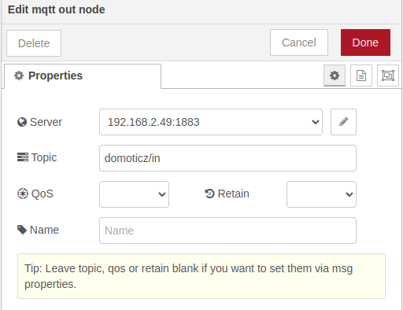
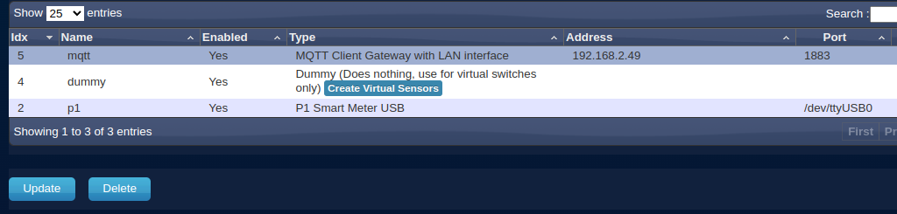
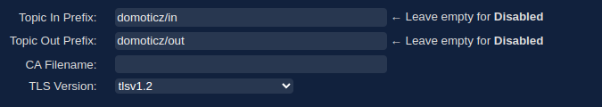
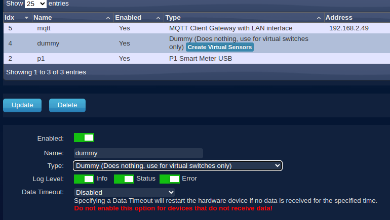
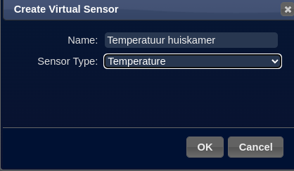
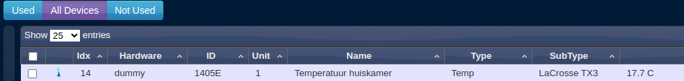

# Blog

## 2023

### 10-03-2023 - CoderDojo Techlab Leusden

Hé jij daar! Ben jij ook zo nieuwsgierig naar hoe computers werken en wil jij leren hoe je zelf kan programmeren? Dan is de [Coderdojo club van LeusdenZeT](https://www.leusdenzet.nl/techlab/coderdojo/) in Leusden echt iets voor jou!

Bij de Coderdojo club kan je samen met andere kinderen van jouw leeftijd leren programmeren, robots bouwen en games maken. Dit doe je natuurlijk niet alleen! Onze mentoren zijn er om jou te helpen en te begeleiden, zodat jij alles goed begrijpt en lekker aan de slag kunt gaan.

Weet je nog helemaal niks van programmeren? Geen probleem! Bij de Coderdojo club beginnen we altijd bij de basis en gaan we stap voor stap verder. Zo kan jij op jouw eigen tempo leren en uiteindelijk ook zelf jouw eigen projecten bedenken en maken.

Maar niet alleen het leren programmeren is belangrijk. Bij de Coderdojo club kan je ook nieuwe vrienden maken en je creativiteit de vrije loop laten. En natuurlijk hebben we ook altijd heel veel lol!

Ben jij tussen de 7 en 17 jaar oud en wil jij graag meer leren over programmeren? Schrijf je dan snel in bij de [Coderdojo club van LeusdenZeT](https://www.leusdenzet.nl/events-category/coderdojo/)! Wij kunnen niet wachten om jou te verwelkomen en samen te ontdekken hoe leuk het is om te programmeren!

### 09-03-2023 - Les over Grafana en InfluxDB containers installeren is klaar

Alle lessen zijn nu klaar en ik ga mijn werk controleren om te zien of alles klopt wat ik heb opgeschreven.

### 08-03-2023 - Temperatuur van de huiskamer in Domoticz weergeven

Domoticz kan ook gegevens ontvangen van de MQTT-broker door zich te abonneren op het onderwerp "domoticz/in".

Referentie: [https://www.huizebruin.nl/domoticz/installatie-domoticz-mq/](https://www.huizebruin.nl/domoticz/installatie-domoticz-mq/)

Ik ga je laten zien hoe je Domoticz kan gebruiken om te zien hoe warm of koud het in de huiskamer is. Zo weet je altijd of je een trui moet aandoen of dat het lekker warm genoeg is!

#### Stap 1: Node-RED applicatie uitbreiden

Sleep twee nodes naar het werkblad: eentje van een "function" en eentje van een "mqtt out". Volg het plaatje in figuur 1 om ze goed in te stellen.

 ``\\``*Figuur 1*

#### Stap 2 - "function" definiëren

Bekijk figuur 2 goed en zorg dat de functie er precies zo uitziet. Misschien moet je de waarde van "idx" later nog veranderen, dat staat in [Stap-6-Idx-in-de-function-aanpasssen](#Stap-6-Idx-in-de-function-aanpasssen) uitgelegd.

 ``\\``*Figuur 2*

#### Stap 3 -  "mqtt out" definiëren

Zet de "mqtt out" zoals in figuur 3 staat afgebeeld. Zo kan de informatie goed worden verstuurd!

 ``\\``*Figuur 3*

#### Stap 4 - Pas de "mqtt" definitie aan

Klik op "Setup" en dan op "Hardware". Zoek naar het document dat "mqtt" heet en klik erop.

 ``\\``*Figuur 4*

Scrol helemaal naar beneden op het formulier en zet bij "Topic in Prefix:" de tekst "domoticz/in".

 ``\\``*Figuur 5*

Druk op de knop "Update" om het formulier bij te werken. Blijf daarna op het formulier.

#### Stap 5 - Maak een "dummy" temperatuurmeter aan in Domoticz

Druk op de knop "Add" onderaan het "mqtt" formulier. Verander het formuliertype naar "Dummy (Does nothing, use for virtual switches only)". Geef het een naam "dummy" en druk op de knop "Update".

 ``\\``*Figuur 6*

Je ziet nu een knop genaamd "Create Virtual Sensors" in de "dummy" regel. Klik op "Create Virtual Sensors" en vul de informatie in zoals weergegeven in "figuur 7". Klik op "OK" als je klaar bent.

 ``\\``*Figuur 7*

### Stap 6 - Idx in de function aanpasssen

Ga naar "Setup" en klik op "Devices". Zoek naar de regel met de tekst "Temperatuur huiskamer" en noteer het "idx"-nummer dat erbij hoort.

 ``\\``*Figuur 8*

Ga terug naar de [Stap 2 - "function" definiëren](#Stap-2-"function"-definiëren) die je eerder hebt ingesteld en verander het "idx"-nummer naar het nummer dat je zojuist hebt genoteerd. Klik vervolgens op de tab "Temperature" om het resultaat te bekijken.

 ``\\``*Figuur 9*

Klik op het sterretje om de temperatuur ook op het Domoticz dashboard te laten zien. Zo kan je de temperatuur makkelijk bekijken!

### 15-02-2023 

Goed nieuws! We hebben de les "Domoticz installeren" afgerond. In de volgende lessen gaan we leren hoe we Domoticz kunnen gebruiken met je Slimme Meter.

En er is nog meer goed nieuws! We hebben ook de les "Slimme meter aansluiten" afgerond. Ik heb zelfs een paar nieuwe schermen toegevoegd van Domoticz.

### 14-02-2023

De les "Node-RED dashboard programma maken" is klaar. Je leert hoe je een dashboard opzet met Node-RED.

### 07-02-2023

De les "Temperatuur meten" is klaar. Ik wil de hele les nog een keer testen en kijken of het goed is.

### 01-02-2023

De les "Website bouwen met Node-RED" is klaar. We gaan leren hoe we gegevens van websites kunnen gebruiken. Dit wordt gedaan door een API te gebruiken. Soms moeten we een account aanmaken om de gegevens te kunnen gebruiken en het is niet altijd gratis. Maar, in deze les maken we een eigen website over Honden en halen we plaatjes van de honden van andere website. Ook leren we hoe we onze website er op elk apparaat hetzelfde uit kan laten zien.

### 25-01-2023

De les over hoe je Node-RED installeert is nu klaar.

### 24-01-2023

We hebben nog wat veranderingen gemaakt in het hoofdstuk over hoe te praten met de Raspberry Pi computer.

Het hoofdstuk "Docker installeren" is klaar. Er zijn een paar manieren om opdrachten te geven aan de Raspberry Pi vanaf je laptop. Dit kan via de computerprogramma's SSH, Docker-Client installeren of via de browser met Portainer. De Docker-Client methode heb ik verwijderd om het overzichtelijker te houden.

Het hoofdstuk "Portainer installeren" is klaar.

### 20-01-2023

In het tweede hoofdstuk 'Communiceren met de Raspberry Pi' is klaar. Je leert hoe je vanaf een laptop kan praten met de Raspberry Pi.

### 19-01-2023

Het hoofdstuk 'Maak je SD-kaartje klaar voor de Raspberry Pi 3B+' is klaar. Het gaat over hoe je een SD-kaartje (dat is een klein kaartje dat je in de Raspberry Pi 3B+ steekt) klaarmaakt zodat je er software op kunt installeren en de Raspberry Pi 3B+ ermee kunt laten werken.

### 16-01-2023
Vandaag ontdekte ik iets nieuws. Je kan al de gegevens van je WiFi invoeren als je je Micro SD-kaart aanmaakt. Je kan dan je laptop verbinden met je Raspberry Pi en erop werken.

## 2022

### 28-12-2022 - Cursus opzet gemaakt

Vandaag de basisstructuur voor de RASPI cursus opgezet.

