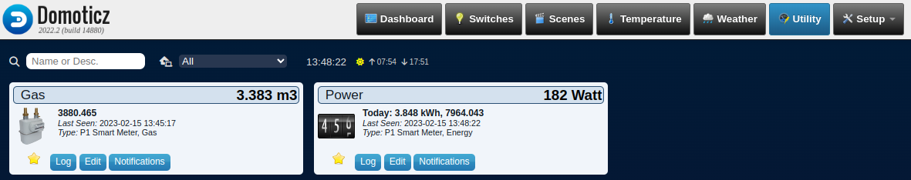

# Domoticz installeren

*Domoticz is een programma dat je kunt gebruiken om het "slimme" huis te beheren. Als je een slimme meter hebt, is het handig om Domoticz te gebruiken om het energieverbruik in huis te bekijken en om op afstand het energieverbruik te controleren.*



### Inhoud

```@contents
Pages = ["chapter10.md"]
```

## Wat je nodig hebt

- Een Raspberry Pi 3B+ met het besturingssysteem Ubuntu Server 22.04.
- Docker en Portainer zijn geinstalleerd.
- De Raspberry Pi heeft verbinding met het Internet.
- Een PC die een SSH verbinding heeft met de Raspberry Pi.

## Wat je gaat doen

Stap 1: Je computer met SSH verbinden met de Raspberry Pi.

Stap 2: Container starten met "docker compose".

Stap 3: Domoticz benaderen met een browser.

### Stap 1 - Je computer met SSH verbinden met de Raspberry Pi

Verbind je computer met de Raspberry Pi en log in.

```
ssh ubuntu@IP_adres_Raspberry_Pi
```

### docker-compose.yml

!!! info
    In het vakje hieronder staat een stukje code. Bovenaan rechts zie je een symbool dat lijkt op twee bladen papier. Als je daarop klikt, kopieer je alle code in het vakje naar het klembord. Dat is heel handig! Het betekent dat je de code ergens anders kunt plakken en het niet opnieuw hoeft te typen.
```
version: '3.3'

services:
  domoticz:
    image: domoticz/domoticz
    container_name: domoticz
    restart: unless-stopped
    # Pass devices to container
    devices:
      - "/dev/ttyUSB0:/dev/ttyUSB0"
    ports:
      - "8081:8080"
    volumes:
      - ./config:/opt/domoticz/userdata
    environment:
      - TZ=Europe/Amsterdam
      #- LOG_PATH=/opt/domoticz/userdata/domoticz.log
```

Stel je voor dat je een computerprogramma hebt dat je helpt bij het besturen van alle slimme apparaten in huis, zoals slimme lampen en thermostaten. Het programma dat we gaan gebruiken heet Domoticz, en we gaan het installeren met behulp van een bestand dat docker-compose.yml heet.

Docker-compose.yml is een bestand dat ons vertelt welke software we willen installeren en hoe we die software willen gebruiken. In dit geval willen we Domoticz installeren en we willen ervoor zorgen dat het altijd blijft draaien, tenzij we het expliciet stoppen.

We willen dat Domoticz toegang heeft tot een specifiek apparaat, namelijk een apparaat dat is aangesloten op de USB-poort van onze computer. We vertellen dit aan Docker door de regel "devices" toe te voegen en de locatie van het apparaat op te geven.

We willen ook dat Domoticz toegankelijk is via onze webbrowser, dus we vertellen Docker om de poort 8081 op onze computer door te sturen naar de poort 8080 waar Domoticz op draait.

We slaan ook een aantal belangrijke instellingen op, zoals onze tijdzone en de locatie waar we gegevens willen opslaan.

Als we alles hebben ingesteld in het docker-compose.yml-bestand, kunnen we de opdracht geven om het programma te starten en Domoticz zal worden geïnstalleerd en geconfigureerd zoals we hebben aangegeven in het bestand.

### Stap 2 - Container starten met "docker compose"

Maak een folder aan onder de folder projects met de naam domoticz.

```
cd projects
mkdir domoticz
cd domoticz
```

Maak een leeg bestand en open het met de nano editor.

```
# Maak docker-compose.yml
nano docker-compose.yml
```

Ga naar de docker-compose.yml sectie [hierboven](#docker-compose.yml). Kopieer de code naar het klembord en plak het in de editor met Ctrl+V. Bewaar het bestand vervolgens met Ctrl+O en verlaat de editor met Ctr+X.

Maak dan de Domoticz comtainer met:

```
# Maak Domoticz container
docker compose up
```

### Stap 3 - Domoticz via een browser

Type in de adresbalk van je browser `IP_adres_Raspberry_Pi:8081` en druk op de Enter-toets.

Je krijgt je Domoticz openingspagina te zien, maar nog niet het verbruik van het gas en de electriciteit. Daarvoor moet je de Raspberry Pi aansluiten op je Slimme meter.

## Samenvatting

Domoticz is een programma dat je helpt om je "slimme" huis te beheren en bijvoorbeeld het energieverbruik te monitoren en controleren. Om Domoticz te gebruiken, heb je een Raspberry Pi 3B+ nodig met het besturingssysteem Ubuntu Server 22.04, Docker en Portainer geïnstalleerd en een computer die verbinding heeft met de Raspberry Pi via SSH.

Om Domoticz te installeren, maak je gebruik van een bestand genaamd docker-compose.yml. Dit bestand vertelt Docker welke software er geïnstalleerd moet worden en hoe het gebruikt moet worden. In dit geval willen we Domoticz installeren en ervoor zorgen dat het altijd blijft draaien, tenzij we het expliciet stoppen.

We willen dat Domoticz toegang heeft tot een specifiek apparaat, bijvoorbeeld een slimme meter dat is aangesloten op de USB-poort van onze computer. Dit kan via de "devices" regel in het docker-compose.yml-bestand. Zo wordt het apparaat doorgegeven aan de container waarin Domoticz draait.

Verder willen we dat Domoticz toegankelijk is via onze webbrowser, zodat we het energieverbruik kunnen monitoren en controleren. Dit kan via de poorten die worden doorgestuurd van de Raspberry Pi naar de computer. We slaan ook belangrijke instellingen op, zoals onze tijdzone en de locatie waar we gegevens willen opslaan.

Nadat we alles hebben ingesteld in het docker-compose.yml-bestand, geven we de opdracht om het programma te starten en Domoticz zal worden geïnstalleerd en geconfigureerd zoals we hebben aangegeven in het bestand.

Om Domoticz te starten, maak je een folder aan onder de folder "projects" met de naam "domoticz" en maak je een leeg bestand aan met de naam "docker-compose.yml". Hierin kopieer je de code die eerder in het artikel is gegeven en sla je het bestand op.

Vervolgens start je de Domoticz container door de opdracht "docker compose up" uit te voeren. Je kunt vervolgens Domoticz openen in je webbrowser door het IP-adres van de Raspberry Pi te gebruiken, gevolgd door de poort 8081.

Met deze stappen kun je Domoticz gebruiken om het energieverbruik in je slimme huis te monitoren en te controleren.