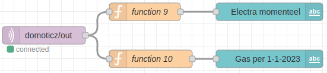
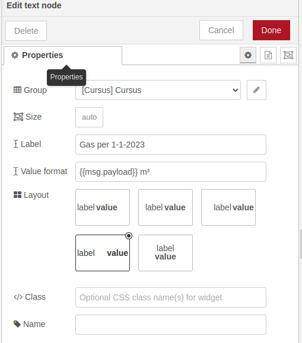

# Stroom- en gasverbruik op het dashboard weergeven

*We willen de gegevens over hoeveel stroom en gas we verbruiken willen laten zien op het Dashboard.*

### Inhoud

```@contents
Pages = ["chapter11.md"]
```

## Wat je nodig hebt

- Een Raspberry Pi 3B+ met het besturingssysteem Ubuntu Server 22.04.
- Docker, Portainer, Domoticz en Node-RED zijn geïnstalleerd.
- De Raspberry Pi heeft verbinding met het Internet.

## Wat je gaat doen

Stap 1: Domoticz gegevens aan de MQTT broker doorgeven.

Stap 2: Domoticz gegevens op het Dashboard weergegeven.

## Stap 1 - Domoticz gegevens aan de MQTT broker doorgeven

Soms wil je misschien weten hoeveel gas en elektriciteit je gebruikt. Om deze informatie te krijgen, kun je deze ook naar onze "MQTT broker" sturen. Je hebt een speciale instelling in Domoticz nodig die een "MQTT client gateway with LAN interface" heet. Die ervoor zorgt dat de informatie naar de MQTT broker wordt gestuurd.

1. Type in de adresbalk van je browser `IP_adres_Raspberry_Pi:8081` en druk op "Enter". Je ziet nu het beginscherm van Domoticz.
2. Log in met de naam "admin" en het wachtwoord "domoticz".
2. Klik op de tab "Setup" en kies dan "Hardware".
3. Druk op de knop "Add" die onderaan de pagina staat. ``\\`` ``\\``
   Vul de volgende waarden in:  ``\\``
   Enabled: Aan  ``\\``
   Name: mqtt ``\\``
   Type: selecteer "MQTT client with LAN interfase"  ``\\``
   Remote Address: `IP_adres_Raspberry_Pi` ``\\``
   Port: 1883 ``\\``
   Prevent Loop: True ``\\``
   Publish Topic: Flat ``\\``
   Topic Out Prefix: domoticz/out ``\\``
   TLS Version: tlsv1.2
5. Druk op de toets "Update" bovenaan de pagina.

## Stap 2 - Domoticz gegevens op het Dashboard weergegeven

Eerder heb je geleerd hoe je informatie op een Dashboard kunt laten zien. Dit is als een magische plek waar je alle gegevens kunt verzamelen die je naar de "MQTT broker" hebt gestuurd.

1. Stel de volgende flows op: ``\\``
2. Kies "domoticz/out" als het onderwerp waarover je informatie wilt verzamelen.
3. Gebruik de code uit deze link voor [functie 9](#JavaScript-code-functie-9). Dit is als een speciaal stukje code dat ervoor zorgt dat de informatie wordt opgehaald en op de juiste manier wordt weergegeven.
4. Gebruik de code uit deze link voor [functie 10](#JavaScript-code-functie-10). Dit zorgt ervoor dat de informatie wordt opgehaald en weergegeven op de juiste plek.
5. Voor "Electra momenteel" moet je deze instellingen gebruiken: ``\\``
6. Voor "Gas per 1-1-2023" moet je deze instellingen gebruiken:  ``\\``


### JavaScript code functie 9

```
var myval = msg.payload;
if (myval.name == 'Power') {
  msg.payload.value = Number(myval.svalue5);
  return msg;
}
```

De informatie die je krijgt, gaat altijd over wat er op dat moment gebeurt. Als je kijkt naar hoeveel stroom je gebruikt, zie je altijd hoeveel stroom je op dat moment verbruikt. En als je een apparaat uitzet, zie je het verschil in het stroomverbruik en weet je dus hoeveel Watt dat apparaat gebruikt.

### JavaScript code functie 10

```
let myvalNew = msg.payload;
let myvalOld = 0;
let myvalStart = 3050.00;

if (myvalNew.name == 'Gas') {
  
  msg.payload = ((Number(myvalNew.svalue1-myvalOld)/1000) - myvalStart).toFixed(2);
  myvalOld = myvalNew.svalue1;
  return msg;

}
```

Bij het gasverbruik krijg je de totale hoeveelheid die is gebruikt, dus vanaf het begin. Daarom moet je de beginwaarde "myvalStart" ervan aftrekken om te weten hoeveel gas er sinds dat moment is gebruikt.

## Samenvatting

Deze les gaat over hoe je op een Dashboard kan zien hoeveel stroom en gas je verbruikt. Hiervoor heb je een Raspberry Pi 3B+ nodig met het besturingssysteem Ubuntu Server 22.04 en een aantal programma's zoals Docker, Portainer, Domoticz en Node-RED. Je moet ervoor zorgen dat de gegevens van Domoticz naar de "MQTT broker" worden gestuurd. Daarna kan je deze informatie ophalen en op de juiste manier weergeven op het Dashboard. Als je bijvoorbeeld kijkt naar hoeveel stroom je op dat moment verbruikt, dan zie je dat op het Dashboard. Bij het gasverbruik krijg je de totale hoeveelheid die is gebruikt, dus vanaf het begin. Daarom moet je de beginwaarde van het gasverbruik aftrekken om te weten hoeveel gas er sinds dat moment is gebruikt.

Ik heb nog de post [**Temperatuur van de huiskamer in Domoticz weergeven**](../blog/#03-2023-Temperatuur-van-de-huiskamer-in-Domoticz-weergeven) aan de blog toegevoegd!


