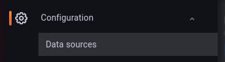
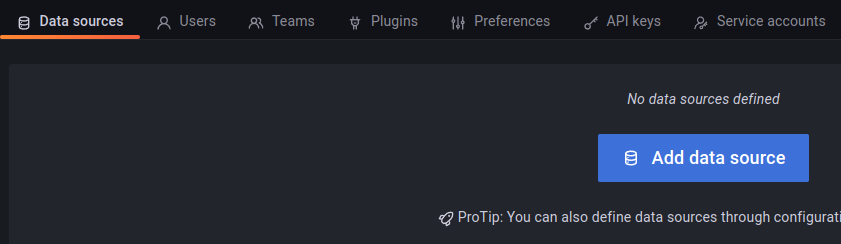

# Grafana en InfluxDB containers installeren

*Grafana is een programma dat je kunt gebruiken om gegevens te visualiseren. Stel je voor dat je een lijst hebt met getallen, zoals de temperatuur in een kamer gedurende een dag. Met Grafana kun je deze getallen op een grafiek zetten, zodat je gemakkelijk kunt zien hoe de temperatuur is veranderd gedurende de dag. Zo kun je bijvoorbeeld zien of de temperatuur is gestegen of gedaald, en hoeveel.

InfluxDB is een programma waarmee je gegevens kunt opslaan en beheren. Stel je voor dat je een lijst hebt met getallen, zoals de temperatuur in een kamer gedurende een week. Met InfluxDB kun je deze getallen opslaan, zodat je ze later weer kunt bekijken. Zo kun je bijvoorbeeld zien hoe de temperatuur is veranderd gedurende een week, en hoeveel.

Grafana en InfluxDB worden vaak samen gebruikt. Met Grafana kun je de gegevens die in InfluxDB zijn opgeslagen visualiseren, zodat je ze gemakkelijk kunt begrijpen en analyseren. Bijvoorbeeld, als je de temperatuur in een kamer wilt bekijken gedurende een week, kun je de gegevens van de temperatuur in InfluxDB opslaan.*

### Inhoud

```@contents
Pages = ["chapter13.md"]
```

## Wat je nodig hebt

- Een Raspberry Pi 3B+ met het besturingssysteem Ubuntu Server 22.04.
- Docker, Portainer en Node-RED zijn geïnstalleerd.
- De Raspberry Pi heeft verbinding met het Internet.

## Wat je gaat doen

Stap 1: Stack met Grafana en Influxdb maken.

Stap 2: Wachtwoord Grafana wijzigen.

Stap 3: Grafana aan InfluxDB koppelen.

Stap 4: Sensor_data database maken.

Stap 5: Data naar database wegschrijven

## Stap 1 - Stack met Grafana en Influxdb maken

### docker-compose.yml
```
version: '3'

services:
  influxdb:
    image: influxdb
    container_name: influxdb
    restart: unless-stopped
    ports:
      - "8086:8086"
    environment:
      - INFLUXDB_DB=mydb
      - INFLUXDB_ADMIN_USER=admin
      - INFLUXDB_ADMIN_PASSWORD=password
      - INFLUXDB_USER=myuser
      - INFLUXDB_USER_PASSWORD=mypassword
    volumes:
      - influxdb_data:/var/lib/influxdb

  grafana:
    image: grafana/grafana
    container_name: grafana
    restart: unless-stopped
    ports:
      - "3000:3000"
    environment:
      - GF_INSTALL_PLUGINS=grafana-clock-panel,grafana-simple-json-datasource
      - GF_SECURITY_ADMIN_USER=admin
      - GF_SECURITY_ADMIN_PASSWORD=password
    volumes:
      - grafana_data:/var/lib/grafana

volumes:
  influxdb_data:
  grafana_data:
```

Dit is een bestand dat aan Docker vertelt hoe het twee programma's moet starten en ze laten samenwerken.

Het eerste programma heet InfluxDB en het tweede heet Grafana.

Voor elk programma staat er een stukje code dat vertelt hoe Docker het moet starten en hoe het met andere programma's kan communiceren.

Voor InfluxDB, vertelt de code Docker om de "influxdb" te starten. Het gebruikt een image van InfluxDB dat al bestaat en zet het in een container genaamd "influxdb". Het vertelt ook Docker om de container te laten communiceren via poortnummer 8086 op de computer waar het op draait. Er worden ook gegevens opgeslagen in een speciale map genaamd "influxdb_data". Dit programma zal altijd opnieuw opstarten als het per ongeluk vastloopt.

Voor Grafana, vertelt de code Docker om de "grafana" te starten. Het gebruikt een plaatje van Grafana dat al bestaat en zet het in een container genaamd "grafana". Het vertelt ook Docker om de container te laten communiceren via poortnummer 3000 op de computer waar het op draait. Er worden ook gegevens opgeslagen in een speciale map genaamd "grafana_data". Dit programma zal ook altijd opnieuw opstarten als het per ongeluk vastloopt.

Het bestand sluit af met een lijst van de speciale mappen die Docker moet maken om gegevens op te slaan.

## Stap 2 - Wachtwoord Grafana wijzigen

Als je de eerste keer inlogt, moet je een gebruikersnaam en wachtwoord invullen. De standaard gebruikersnaam is "admin" en het wachtwoord is ook "admin". Maar het is belangrijk om je wachtwoord te veranderen zodat het veiliger is. Als je inlogt, zal er worden gevraagd of je je wachtwoord wilt veranderen. Zorg ervoor dat je een nieuw en sterk wachtwoord kiest dat niemand anders kan raden.


## Stap 3 - Grafana aan InfluxDB koppelen

Verbreed het menu door op het venster te verbreden door op ">" te klikken. Ga naar "Configuration" en klik op "Data sources".



Klik op de knop "Add data source".



 Kies voor "InfluxDB".


Grafana en InfluxDB werken nu samen.

## Samenvatting

Grafana en InfluxDB zijn programma's die samen kunnen worden gebruikt om gegevens te visualiseren en op te slaan. Grafana helpt om deze gegevens op een grafiek te zetten, terwijl InfluxDB helpt om deze gegevens op te slaan en te beheren. De installatie van deze programma's kan worden gedaan door het uitvoeren van een aantal stappen op een Raspberry Pi 3B+ met het Ubuntu Server-besturingssysteem. Deze stappen omvatten het maken van een stapel met Grafana en InfluxDB, het wijzigen van het wachtwoord van Grafana en het koppelen van Grafana aan InfluxDB. De code toont de instellingen voor de containerdiensten Grafana en InfluxDB.