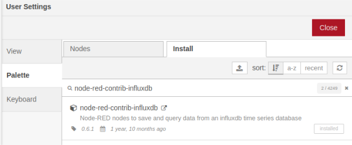

# Gegevens opslaan in een Influx database met Node-RED

*In dit hoofdstuk leer je hoe je gegevens kunt opslaan in een speciaal programma genaamd Influx database. Dit programma is gemaakt om gegevens te bewaren, zoals bijvoorbeeld temperaturen of vochtigheid. We gebruiken Node-RED om de gegevens naar de Influx database te sturen. Zo kunnen we de gegevens later gemakkelijk terugvinden en bekijken.*

### Inhoud

```@contents
Pages = ["chapter14.md"]
```

## Wat je nodig hebt

## Wat je gaat doen

Stap 1: nfluxDB module in Node-RED maken.

Stap 2: Sensor_data database maken.

Stap 3: Data naar database wegschrijven

## Stap 1 - InfluxDB module in Node-RED maken



## Stap 2 - Sensor_data database maken

CREATE DATABASE sensor_data

## Stap 3 - Data naar database wegschrijven

USE sensor_data

influx -precision 'rfc3339' # datum in yyyy-mm-dd formaat

In Node-RED:
JSON object creeert de tabel "test", die staat gedefinieerd in de node "influxdb out" onder measurments. Aantal items bepaalt aantal kolommen,
naast de eerste kolom die datum en tijd bevat.
{
    temp: Number(myval),   # de meting
    type: "temp" ,         # additionele informatie
    locatie: "LR"          # additionele infromatie
}

select * from test =>

2023-02-23T14:10:11.630083951Z LR      17.9 temp
2023-02-23T14:10:17.685277494Z LR      18   temp
2023-02-23T14:10:23.700484434Z LR      17.9 temp

## Samenvatting

