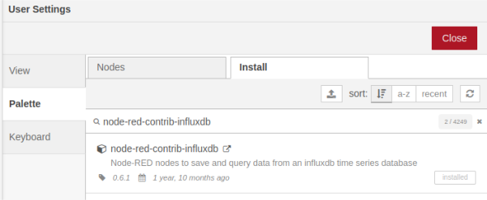
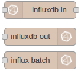
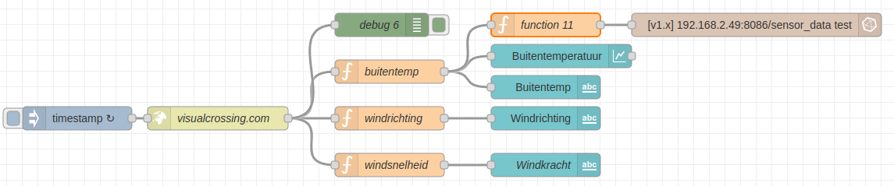
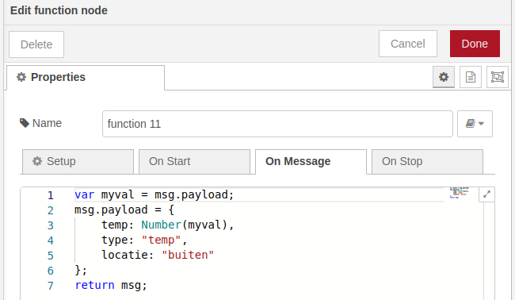
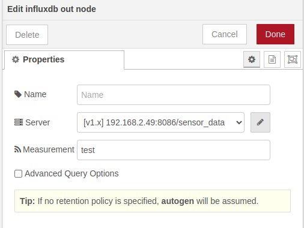
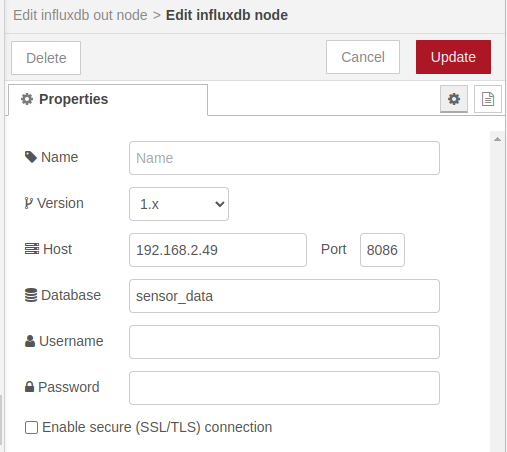

# Gegevens opslaan in een Influx database met Node-RED

*In dit hoofdstuk leer je hoe je gegevens kunt opslaan in een speciaal programma genaamd Influx database. Dit programma is gemaakt om gegevens te bewaren, zoals bijvoorbeeld temperaturen of vochtigheid. We gebruiken Node-RED om de gegevens naar de Influx database te sturen. Zo kunnen we de gegevens later gemakkelijk terugvinden en bekijken.*

### Inhoud

```@contents
Pages = ["chapter14.md"]
```

## Wat je nodig hebt

- Een Raspberry Pi 3B+ met het besturingssysteem Ubuntu Server 22.04.
- Docker, Portainer, Node-RED, InfluxDB en Grafana zijn geïnstalleerd.
- Node-RED programma uit de les 9 [Node-RED dashboard programma maken](../chapter9/index.html).
- De Raspberry Pi heeft verbinding met het Internet.

## Wat je gaat doen

Stap 1: InfluxDB module in Node-RED maken.

Stap 2: Sensor_data database maken.

Stap 3: Data naar database wegschrijven

## Stap 1 - InfluxDB module in Node-RED maken

|Stap        | Actie      |
|:---------- | :---------- |
| 1 | Open de webinterface van Node-RED met `IP_adres_Raspberry_Pi:1880`. |
| 2 | Kies uit het menu voor "Manage palette". |
| 3 | Klik op de "Install" tab en zoek naar "node-red-contrib-influxdb". ``//`` |
| 4 | Druk op de knop "Install". |
| 5 | In het Node-RED menu vind je de drie knooppunten: ``\\`` |
||

## Stap 2 - Sensor_data database maken

|Stap        | Actie      |
|:---------- | :---------- |
| 1 | Ga naar de webinterface van Portainer en login: "IP_adres_Raspberry_Pi:9000". |
| 2 | Klik op ">\_" symbool van de influxdb container. ``\\`` |
| 3 | Druk op de knop: "Connect". ``\\`` |
| 4 | Om de datum als "jjjj-mm-dd" weer te geven, typ: `influx -precision 'rfc3339'` en druk op Enter. |
| 5 | Om de database "sensor\_data" te maken, typ: `create database sensor_data` en druk op Enter. |
| 6 | Verlaat de database interface met Ctrl-D. |
| 7 | Verlaat de container interface met Ctrl_D. |
||

## Stap 3 - Data naar database wegschrijven

|Stap        | Actie      |
|:---------- | :---------- |
| 1 | Open Node-RED. |
| 2 | Sleep een `function` en het `influx out` knooppunt naar je werkblad en verbind de knooppunten volgens het schema. ``\\`` |
| 3 | Open het `function` knooppunt en type de volgende code. ``\\`` |
| 4 | Druk op de toets "Done". |
| 5 | Open het `influx out` knooppunt. |
| 6 | Klik op het "potloodje". ``\\`` ``\\``In Node-RED: JSON object creeert de tabel "test", die staat gedefinieerd in het knooppunt "influxdb out" onder "Measurments". Aantal items bepaalt aantal kolommen, naast de eerste kolom die datum en tijd bevat:
          {
              temp: Number(myval),   // de meting
              type: "temp",          // extra informatie
              locatie: "LR"          // extra informatie
          }

|Stap        | Actie      |
|:---------- | :---------- |
| 7 | Vul het ip adres van je Raspberry Pi in en geef als naam van de database sensor\_data op.  |
| 8 | Druk op de knop "Update". |
| 9 | Druk op de knop "Done". |
| 10 | Druk op de knop "Deploy". |
||

Open de container interface en open de database interface met `influx -precision 'rfc3339' # datum in yyyy-mm-dd formaat`

Open database en typ `use sensor_data` en daarna `select * from test. Je krijg het volgende te zien:
```
2023-03-02T13:10:05.228259851Z buiten  10   temp
2023-03-02T13:40:05.289277559Z buiten  10.1 temp
2023-03-02T14:10:05.322618876Z buiten  10.1 temp
```

## Samenvatting

In deze les leer je hoe je gegevens zoals temperaturen en vochtigheid kunt opslaan in een Influx database met behulp van Node-RED. Om dit te doen heb je een Raspberry Pi 3B+ nodig met Docker, Portainer, Node-RED, InfluxDB en Grafana. Je moet ook het Node-RED dashboard programma hebben gemaakt en de Raspberry Pi moet verbinding hebben met het internet. Er zijn drie stappen om gegevens naar de Influx database te sturen: 1) een InfluxDB-module in Node-RED maken, 2) een sensor_data database maken, en 3) de data naar de database wegschrijven. Om deze stappen uit te voeren moet je verschillende acties ondernemen, zoals het openen van de webinterface van Node-RED, het zoeken naar de node-red-contrib-influxdb en het maken van een database. Je moet ook een functie- en influx-out knooppunt slepen naar je werkblad en deze verbinden volgens het schema. Ten slotte moet je het IP-adres van je Raspberry Pi invoeren en de naam van de database sensor_data opgeven, en daarna op de knop 'Deploy' drukken. Als je alles goed hebt gedaan, kun je later de gegevens gemakkelijk terugvinden en bekijken.
