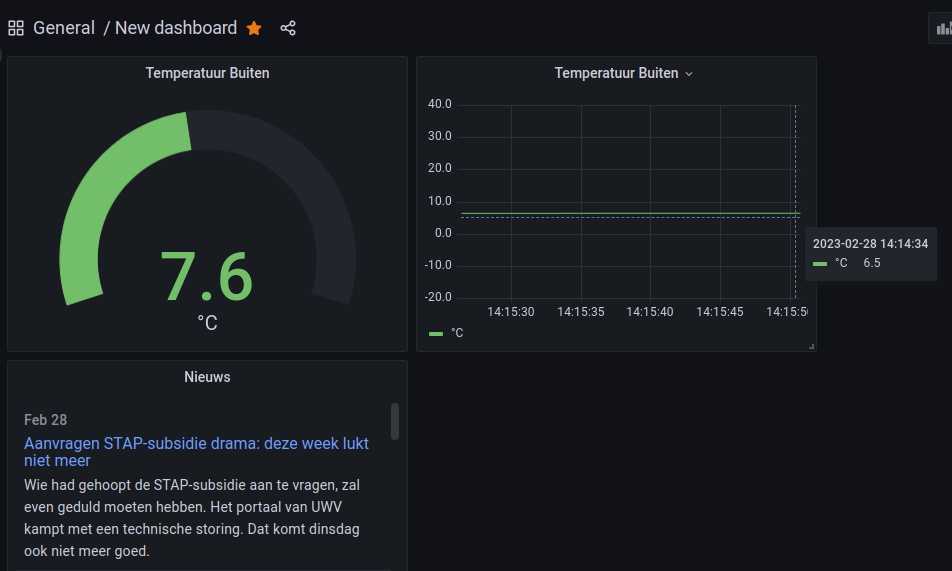

# Gegevens in de Influx database grafisch weergeven met Grafana

*Je leert hoe je gegevens uit de Influx database kunt gebruiken om grafieken te maken. Dit kan handig zijn om bijvoorbeeld trends te zien in de temperatuur of vochtigheid. We gebruiken het programma Grafana om de gegevens uit de Influx database te halen en om de grafieken te maken. Zo kunnen we gemakkelijk zien hoe de gegevens zich in de tijd hebben ontwikkeld.*


*Nieuws van 1 mrt. 2023*

### Inhoud

```@contents
Pages = ["chapter15.md"]
```

## Wat je nodig hebt

- Een Raspberry Pi 3B+ met het besturingssysteem Ubuntu Server 22.04.
- Docker, Portainer, Node-RED, InfluxDB en Grafana zijn geinstalleerd.
- Node-RED programma uit de les 9 [Node-RED dashboard programma maken](../chapter9/index.html).
- De Raspberry Pi heeft verbinding met het Internet.

## Wat je gaat doen

Stap 1: Temperatuur als uitslagmeter weergeven.

Stap 2: Temperatuur in een lijngrafiek laten zien.

Stap 3: RSS nieuwsberichten weergeven.

### Stap 1 - Temperatuur als uitslagmeter weergeven

### Stap 2 - Temperatuur in een lijngrafiek laten zien

### Stap 3 - RSS nieuwsberichten weergeven

RSS staat voor Really Simple Syndication of soms ook wel "Rich Site Summary", zie bijvoorbeeld [(Syndicatie Nederlandse RSS-feeds)](https://www.nationalemediasite.nl/rss-feeds.php). Het is een manier om updates en nieuws van websites bij te houden zonder dat je elke keer naar die websites hoeft te gaan om te zien of er iets nieuws is.

Stel je bijvoorbeeld voor dat je graag het nieuws leest op verschillende websites, maar het is vervelend om elke keer naar elke website te gaan om te zien of er iets nieuws is. Met RSS kun je je abonneren op de RSS-feed van die websites en elke keer dat er iets nieuws wordt toegevoegd, krijg je automatisch een melding of een update.

Je kunt RSS-feeds bekijken in een speciale RSS-lezer of in een internetbrowser met een ingebouwde RSS-functie. Door RSS te gebruiken, kun je dus snel en gemakkelijk op de hoogte blijven van nieuwe inhoud op de websites die je volgt, zonder dat je steeds handmatig de websites hoeft te bezoeken.


## Samenvatting
