# Gegevens in de Influx database grafisch weergeven met Grafana

*Je leert hoe je gegevens uit de Influx database kunt gebruiken om grafieken te maken. Dit kan handig zijn om bijvoorbeeld trends te zien in de temperatuur of vochtigheid. We gebruiken het programma Grafana om de gegevens uit de Influx database te halen en om de grafieken te maken. Zo kunnen we gemakkelijk zien hoe de gegevens zich in de tijd hebben ontwikkeld.*


*Nieuws van 1 mrt. 2023*

### Inhoud

```@contents
Pages = ["chapter15.md"]
```

## Wat je nodig hebt

- Een Raspberry Pi 3B+ met het besturingssysteem Ubuntu Server 22.04.
- Docker, Portainer, Node-RED, InfluxDB en Grafana zijn geinstalleerd.
- Node-RED programma uit de les 9 [Node-RED dashboard programma maken](../chapter9/index.html).
- De Raspberry Pi heeft verbinding met het Internet.

## Wat je gaat doen

Stap 1: Temperatuur als uitslagmeter weergeven.

Stap 2: Temperatuur in een lijngrafiek laten zien.

Stap 3: RSS nieuwsberichten  weergeven.

### Stap 1 - Temperatuur als uitslagmeter weergeven

|Stap        | Actie      |
|:---------- | :---------- |
| 1 | Typ in de webbrowser adresbalk: `IP_adres_Raspberry_Pi:3000`. Hierdoor open je de webinterface van Grafana. |
| 2 | Open het menu door op `>` te klikken. ``\\``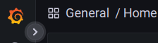. |
| 3 | Klik op `Dashboards > + New dashboard`. ``\\``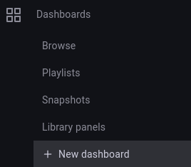. |
| 4 | Klik op `Add a new panel`. ``\\``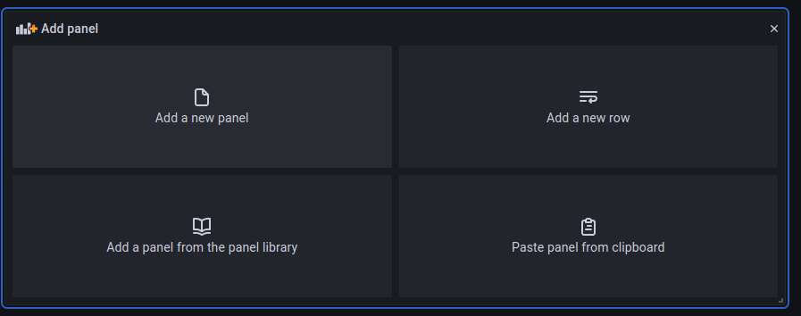. |
| 5 | Klik op `⌄`. ``\\`` |
| 6 | Kies voor `Gauge`. Een Gauge geeft de laatste meetwaarde weer. ``\\``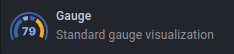 |
| 7 | Druk op het podloodje en type: `select * from test`. ``\\``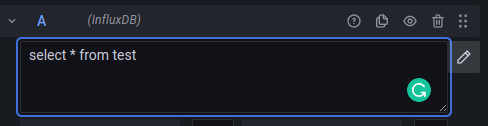 |
| 8 | In het rechter paneel type de titel van de grafiek: `Temperatuur buiten`. ``\\``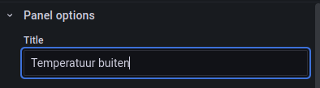 |
| 9 | Druk op de kop "Save" 2x. ``\\`` |
| 10 | Keer terug naar het Dashboard overzicht met "<- Dashboard" en verklein de grafiek vanuit de hoek rechtsonder. ``\\``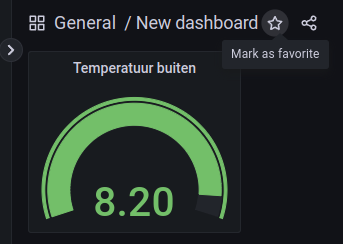 ``\\``*Door op het sterretje te klikken komt het dashboard in de sterrenlijst* |
||

Je kunt achteraf de instellingen van de grafiek wijzigen door op titel `Temperatuur buiten` te klikken en kiezen voor "Edit". Met het tandwieldje (Dashboard setting) geeft je het dashboard een andere naam: 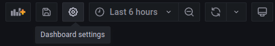

### Stap 2 - Temperatuur in een lijngrafiek laten zien

|Stap        | Actie      |
|:---------- | :---------- |
| 1 | Klik op de grafiektitel en kies voor "More... > Duplicate ``\\``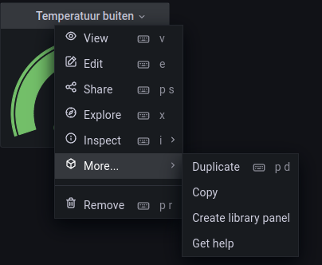 |
| 2 | Kies als grafiektype "Time series". ``\\``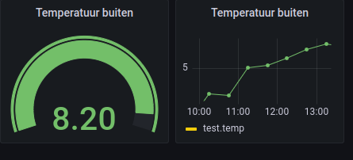 |
||

### Stap 3 - RSS nieuwsberichten weergeven

RSS staat voor Really Simple Syndication of soms ook wel "Rich Site Summary", zie bijvoorbeeld [(Syndicatie Nederlandse RSS-feeds)](https://www.nationalemediasite.nl/rss-feeds.php). Het is een manier om updates en nieuws van websites bij te houden zonder dat je elke keer naar die websites hoeft te gaan om te zien of er iets nieuws is.

Stel je bijvoorbeeld voor dat je graag het nieuws leest op verschillende websites, maar het is vervelend om elke keer naar elke website te gaan om te zien of er iets nieuws is. Met RSS kun je je abonneren op de RSS-feed van die websites en elke keer dat er iets nieuws wordt toegevoegd, krijg je automatisch een melding of een update.

Je kunt RSS-feeds bekijken in een speciale RSS-lezer of in een internetbrowser met een ingebouwde RSS-functie. Door RSS te gebruiken, kun je dus snel en gemakkelijk op de hoogte blijven van nieuwe inhoud op de websites die je volgt, zonder dat je steeds handmatig de websites hoeft te bezoeken.

|Stap        | Actie      |
|:---------- | :---------- |
| 1 | Klik op de titel van de laatste grafiek en mssk een duplikaat. |
| 2 | Sleep de nieuwe grafiek onder  de eerste twee grafieken. |
| 3 | Verander het grafiektype in: News (RSS feed reader). ``\\``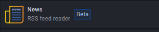 |
| 4 | Ga naar [(Syndicatie Nederlandse RSS-feeds)](https://www.nationalemediasite.nl/rss-feeds.php) en kies een feed. Stel dat je kies voor "Nieuwsportaal" dan is de link "https://www.telegraaf.nl/rss". Kopieer de link. |
| 5 | Plak de link in het vak "URL" van "Neuws" en pas de afmetingen van de "grafiek" aan. Bewaar de feed". ``\\``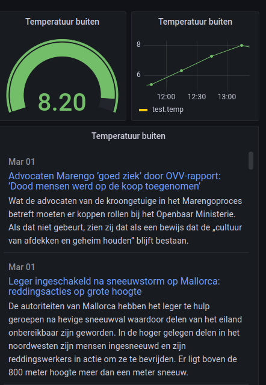 |
||

## Samenvatting

In deze les leer je hoe je gegevens uit een database kunt gebruiken om grafieken te maken met Grafana. Dit kan handig zijn om trends te zien in bijvoorbeeld temperatuur en vochtigheid. Hiervoor heb je een Raspberry Pi 3B+ nodig met bepaalde programma's geïnstalleerd. Vervolgens kun je stap voor stap leren hoe je een grafiek maakt voor de temperatuur, hoe je deze grafiek aanpast en hoe je RSS nieuwsberichten kunt weergeven in een grafiek. RSS is een manier om updates en nieuws van websites bij te houden zonder steeds handmatig de websites te bezoeken.