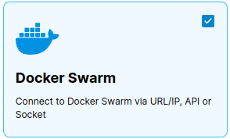
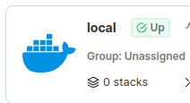
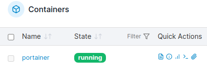

# Portainer installeren

*Portainer is een programma waarmee we onze Docker-omgeving gemakkelijker kunnen beheren. Dit betekent dat we een overzicht krijgen van alle computerprogramma's die we in Docker hebben staan en dat we deze programma's gemakkelijker kunnen starten en beheren.*

### Inhoud

```@contents
Pages = ["chapter4.md"]
```

## Wat je nodig hebt

- Een Raspberry Pi 3B+ met het besturingssysteem Ubuntu 22.04 (zie het vorige hoofdstuk).
- SSH verbinding met de Raspberry Pi.

## Wat je gaat doen

Je hebt geen account nodig als je 'images' van containers wilt downloaden. De image van Portainer heet `portainer/portainer-ce` en gaan we gebuiken om een container op de Raspberry Pi te maken.

[Docker Hub](https://hub.docker.com/) is een website waar veel software zit in kleine stukjes die images heten. Een image is een soort mal of patroon dat je kunt gebruiken als basis voor iets dat je wilt maken, bijvoorbeeld een container. Zo hoef je niet alles opnieuw te bedenken of te maken, maar kun je snel aan de slag met de dingen die echt belangrijk zijn voor jouw project.

Je hoeft geen account te hebben om deze images te downloaden en te gebruiken om containers te maken. We gaan een speciaal stukje software gebruiken dat `portainer/portainer-ce` heet, een programma waarmee we onze Docker-omgeving gemakkelijker kunnen beheren. We hebben het images nodig om er een container van te maken op de Raspberry Pi.

Stap 1: Container met Portainer installeren.

## Stap 1 - Container met Portainer installeren

Vaak zul je verder moeten zoeken op het Internet hoe je een container moet installeren. Op de [PiMyLife](https://pimylifeup.com/raspberry-pi-portainer/) vind je het volgende commando: `sudo docker run -d -p 9000:9000 --name=portainer --restart=always -v /var/run/docker.sock:/var/run/docker.sock -v portainer_data:/data portainer/portainer-ce:latest`.

Met dit commando wordt een container gemaakt, die uitgevoerd wordt in de achtergrond met de -d optie. Poort 9000 van de container wordt gekoppeld aan de poort 9000 van de Raspberry Pi met de -p optie. Een poort verwijst dus naar een specifieke soort software. De container wordt "portainer" genoemd met de \-\-name optie. De container wordt automatisch herstart na een systeemcrash of een reboot met de \-\-restart optie. Met de -v optie wordt de container gekoppeld aan de folder /var/run/docker.sock). De data van de container wordt er opgeslagen. Als we eenmaal Portainer hebben geinstalleerd kunnen we er ook andere containers mee installeren.

|Stap        | Actie      |
|:---------- | :---------- |
| 1 | Maak verbinding met je Raspberry Pi-computer door dit commando te typen: `ssh ubuntu@IP-adres Raspberry Pi`. Bijvoorbeeld: `ssh ubuntu@192.168.2.49`. |
| 3 | We gaan werken met de "Docker Standalone" omgeving. |
| 4 | Installeer Portainer met dit commando: `sudo docker run -d -p 9000:9000 --name=portainer --restart=unless-stopped -v /var/run/docker.sock:/var/run/docker.sock -v portainer_data:/data portainer/portainer-ce:latest`. |
| 5 | Ga naar de Portainer website door `IP_adres_Raspberry_Pi:9000` in de adresbalk van je webbrowser te typen. Bijvoorbeeld: 192.168.2.49:9000. |
| 6 | Maak een account aan met gebruikersnaam "admin". Zorg dat je de gebruikersnaam opschrijft. |
| 7 | Kies een wachtwoord, zorg dat je het opschrijft. |
| 8 | Je gaat nu Portainer geschikt maken voor de Docker Standalone. Klik op "Add Environments". ``\\`` |
| 9 | Activeer "Docker Standalone" door op het viekantje rechtsboven te klikken. ``\\`` |
| 10 | Ververs je browser met http://IP-adres Raspberry Pi:9000/, bijvoorbeeld: http://192.168.2.49:9000
| 11 | Klik op "stacks" in het rechter venster. ``\\`` |
| 12 | Klik op "containers" in het menu links en je krijgt een lijst te zien van alle containers die draaien onder Docker. ``\\`` |
||

!!! info
    We gebruiken in het commando de optie "\-\-restart=unless-stopped", zodat we de Portainer container ook kunnen verwijderen als we hem stoppen.

    Als je een container hebt met de naam portainer (\-\-name=portainer) en je wilt het verwijderen, dan kan je dat doen door in de terminal te typen:
    ```
    docker rm -f portainer
    ```
    Je kan jezelf een hoop typewerk besparen, door in het vak te klikken op het kopieer  symbool". Zo kopieer je alle tekst in dat vak naar het klembord. Je plakt het terug in de terminal met "Ctrl + Shift + V".

## Samenvatting

Portainer is een programma waarmee je gemakkelijker je Docker-omgeving kunt beheren, zoals het starten en stoppen van computerprogramma's. Om Portainer te installeren op een Raspberry Pi 3B+ met het besturingssysteem Ubuntu 22.04, heb je een SSH-verbinding nodig met de Raspberry Pi. Je gebruikt een stukje software dat een "image" wordt genoemd en dat portainer/portainer-ce heet. [Docker Hub](https://hub.docker.com/) is een website waar veel van deze software-images te vinden zijn. Met een speciaal commando wordt een container gemaakt, die Poort 9000 van de container koppelt aan de poort 9000 van de Raspberry Pi en automatisch opnieuw opstart na een systeemcrash of een reboot. Als je Portainer hebt geïnstalleerd, kun je ook andere containers installeren. Om Portainer te verwijderen, gebruik je het commando "docker rm -f portainer". Om Portainer te gebruiken, maak je een account aan met een gebruikersnaam en wachtwoord. Door op "stacks" te klikken, kun je de containers bekijken die onder Docker draaien, zoals "portainer".