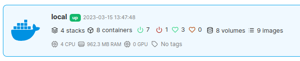
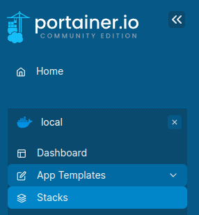
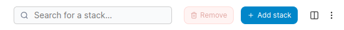
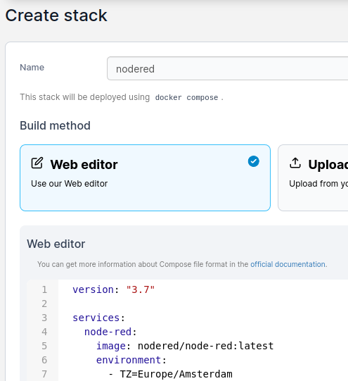
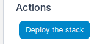

# Node-RED installeren

*In deze les gaan we leren hoe je Node-RED installeert in een container met behulp van Portainer op een Raspberry Pi. Portainer is een programma dat het makkelijker maakt om containers te beheren. Node-RED is een tool die je helpt bij het maken van slimme toepassingen door middel van eenvoudige programma's die we "flows" noemen.*

### Inhoud

```@contents
Pages = ["chapter5.md"]
```

## Wat je nodig hebt

- Een Raspberry Pi 3B+ met het besturingssysteem Ubuntu Server 22.04.
- Docker en Portainer zijn geinstalleerd.
- Een SSH verbinding met de Raspberry Pi vanuit je laptop.

## Wat je gaat doen

We gaan gebruikmaken van Portainer om Node-RED te installeren. Dat doen we door een stack te maken met een docker-compose.yml bestand. Een docker-compose.yml bestand bevat de instructies voor Docker om een container te maken. 

Het voordeel van een docker-compose.yml bestand is dat je er gemakkelijk voorbeelden van kan vinden op het Internet.

Stap 1: Inloggen op Portainer en naar Stacks gaan.

Stap 2: De docker-compose.yml gegevens naar het klembord kopieren.

Stap 3: De docker-compose.yml in de stack plakken.

Stap 4: De container gegevens verversen en bekijken.

### docker-compose.yml
```
################################################################################
# https://nodered.org/docs/getting-started/docker
################################################################################
version: "3.7"

services:
  node-red:
    image: nodered/node-red:latest
    environment:
      - TZ=Europe/Amsterdam
    ports:
      - "1880:1880"
    networks:
      - node-red-net
    volumes:
      - node-red-data:/data

volumes:
  node-red-data:

networks:
  node-red-net:
```

Dit is een bestand dat Docker gebruikt om een container met Node-RED te maken. Het haalt het image (nodered/node-red:latest) van het internet van [Docker Hub](https://hub.docker.com/). `latest` geeft aan dat we altijd de nieuwste versie gebruiken. De tijdzone (TZ=Europe/Amsterdam) staat op die van Amsterdam. We geven ook toegang tot het programma vanaf de Raspberry Pi via poort 1880. Ook maken we op de Raspberry Pi een plek node-red-data om gegevens op te slaan.

Een computerpoort is net zoals een loket in het gemeentehuis. Als je iets wilt regelen bij de gemeente, ga je naar het loket. Dit is de plek waar je iets kunt aanvragen of afgeven, zoals een vergunning of een formulier.

Net zoals elk loket in het gemeentehuis een specifieke functie heeft, hebben poorten op een computer een specifieke functie. Deze functies zijn vergelijkbaar met die van een specifiek programma in een container. Bijvoorbeeld poort 1880 op de Raspberry Pi die is toegewezen aan Node-RED kan worden gebruikt voor het verzenden en ontvangen van data tussen Node-RED en een andere computer.

## Stap 1: Inloggen op Portainer en naar Stacks gaan

Je gaat met behulp van Portainer een stack maken voor de Node-RED container. Een stack staat beschreven wat de container moet doen en heet meestal docker-compose.yml. Het beschrijft wat het image is dat gebruikt moet worden. Een image is te vergelijken met een template. Veel images met name van bekende programma's vind je op [Docker Hub](https://hub.docker.com/) een soort algemene bibliotheek. 

|Stap        | Actie      |
|:---------- | :---------- |
| 1 | Typ `IP-adresRaspberryPi:9000` in je browser, bijvoorbeeld: 192.168.2.49:9000. Dit zorgt dat je Portainer opent in je internetbrowser, zoals Chrome of Firefox. |
| 2 | Klik op 'stacks' in Portainer. Dit zorgt dat een nieuw menu opent. ``\\`` |
| 3 | Klik in het menu op 'Stack'. Hierdoor zie je een lijst met verschillende stacks en wat ze doen. ``\\`` |
||


## Stap 2: De docker-compose.yml gegevens naar het klembord kopieren

Je gaat de tekst uit het bestand "docker-compose.yml" kopiëren naar het klembord..

|Stap        | Actie      |
|:---------- | :---------- |
| 1 | Klik op deze link: [docker-compose.yml](#docker-compose.yml)/ Daar staat de code die je moet hebben. |
| 2 | Selecteer alle tekst met je muis. Regels die beginnen met "#" zijn notitieregels en hoef je niet te selecteren. |
| 3 | Druk op `Ctrl + C`. Dit zet de tekst naar het klembord, zodat je het later gemakkelijk kunt plakken. |
||

## Stap 3: De docker-compose.yml in de stack plakken

In deze stap ga je een pagina maken waarin je de gegevens van de stack vermeldt.

|Stap        | Actie      |
|:---------- | :---------- |
| 1 | Klik op de knop `Add stack` ``\\`` |
| 2 | Type `nodered` in het veld "Name". De naam van de stack. |
| 3 | Klik op de eerste regel in het veld "Web-editor". Hier moet de tekst uit docker-compose.yml komen te staan. |
| 5 | Druk op `Ctrl + V`. Hiermee plak je de tekst van het klembord in het veld. ``\\`` |
| 6 | Helemaal onderaan de pagina, klik op de knop "Deploy the stack". ``\\`` |
||

## Samenvatting

In dit hoofdstuk leer je hoe je Node-RED installeert op een Raspberry Pi met behulp van Portainer. Node-RED is een tool die je helpt bij het maken van slimme toepassingen met behulp van eenvoudige programma's die we "flows" noemen. Om Node-RED te installeren, heb je een Raspberry Pi 3B+ nodig met het besturingssysteem Ubuntu Server 22.04, Docker en Portainer zijn geïnstalleerd en een SSH-verbinding met de Raspberry Pi vanaf je laptop. We maken gebruik van Portainer om Node-RED te installeren door een stack te maken met een docker-compose.yml bestand. Dit bestand bevat de instructies voor Docker om een container te maken. Je gaat een stack maken voor de Node-RED container en het docker-compose.yml bestand kopiëren en plakken in de stack. Vervolgens vernieuw je de containergegevens en bekijk je deze. Node-RED gebruikt poort 1880 om toegang te krijgen tot het programma op de Raspberry Pi. Een poort op een computer is vergelijkbaar met een loket in het gemeentehuis dat een specifieke functie heeft. Een image in Docker is te vergelijken met een template en veel images van bekende programma's vind je op Docker Hub.
