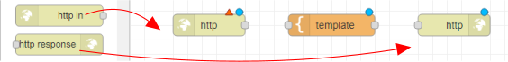
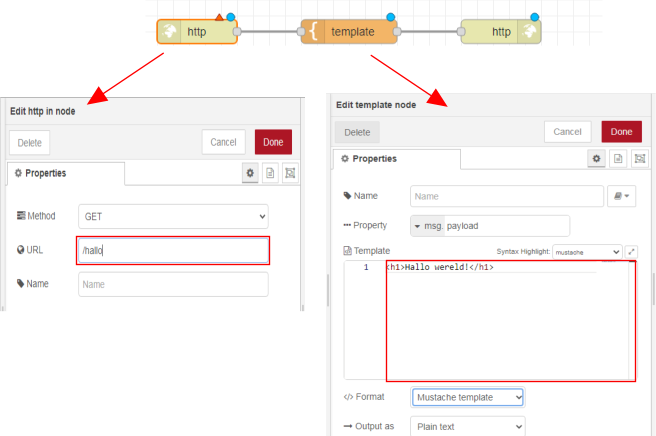

# Website bouwen met Node-RED

*We gaan een website maken met Node-RED. De website werkt alleen op het WiFi-netwerk waar we op zijn aangesloten. Dit betekent dat we de website alleen kunnen bekijken als we met onze computer of telefoon verbonden zijn met het WiFi-netwerk. Tijdens het maken van de website leer je ook werken met HTML-code. HTML is een soort taal waarmee we websites kunnen maken.*

### Inhoud

```@contents
Pages = ["chapter6.md"]
```

## Wat je nodig hebt

- Een Raspberry Pi 3B+ met het besturingssysteem Ubuntu Server 22.04.
- Docker, Portainer en Node-RED zijn geinstalleerd.

## Wat je gaat doen

Stap 1: Introductie tot Node-RED en een "Hallo wereld!" voorbeeld.

Stap 2: Werken met API's.

Stap 3: Personaliseer je website.

## Stap 1: Introductie tot Node-RED en een "Hallo wereld!" voorbeeld

Je hebt 3 knooppunten (nodes) nodig om een eenvoudige website te maken:
- http in
- template (staat in functie, 1 sectie hoger)
- http response

Met "http in" vertel je hoe mensen naar een specifieke pagina op je website kunnen gaan. De pagina is te vinden op het adres IP_adres_raspberry_pi:1880/naam\_pagina. "http response" zorgt ervoor dat de pagina er mooi uitziet door middel van iets watHTML-code heet. In "template" kun je zien hoe de HTML-code eruit ziet.

**Voer de volgende stappen uit:**

1. Ga met je browser naar `IP_adres_raspberry_pi:1880`.
2. Sleep de knooppunten (nodes) naar je werkblad (canvas). Zie ook [Inleiding NodeRed](https://eelcodijkstra.github.io/iot-0/html/inleiding/nodered-inleiding.html) van Eelco Dijkstra.
    
   

3. Verbind de knooppunten met de muis aan elkaar. Steeds een eindpunt met een beginpunt. Als je alle knooppunten aan elkaar hebt geplakt, heb je een "Flow". Dit is een soort programma.
4. Dubbelklik op het `http in` knooppunt en geef als URL op: `/hallo`.
5. Dubbelklik op template en tik `<h1>Hallo wereld!</h1>` op de eerste regel van het veld "template".
   
   
   
6. Klik op de knop "Deploy" boven aan rechts om de code te maken voor je website.

   

7. Typ in de zoekbalk van je internet browser: `IP_adres_Raspberry_Pi:1880/hallo`. Als alles goed is gegaan, zie je 'Hallo wereld!' in vette letters verschijnen op het scherm.
    
   

8. Voeg meer tekst toe aan de website door ze tussen de `<p>` en `</p>` tags te zetten.

## Stap 2: Werken met API's

Een API is een manier voor computers om met elkaar te praten en informatie uit te wisselen. Ze doen dit door verzoeken en antwoorden uit te wisselen. JSON is een manier om informatie op te slaan en uit te wisselen die zowel door computers als door mensen begrepen wordt.

Zo is er de website [Dogs](https://dog.ceo/api/breeds/image/random) die steeds de URL van een ander plaatje van een hond geeft in JSON formaat:

```
{
  "status":"success",
  "message":"https://images.dog.ceo/breeds/segugio-italian/n02090722_002.jpg"
}
```

De code bevat twee delen: een sleutel en een waarde gescheiden door een dubbele punt (:). De sleutel is aan de linkerkant en de waarde is aan de rechterkant.

De eerste sleutel is "status" en de waarde is "success". Dit betekent dat alles goed is gegaan en er geen fouten zijn opgetreden.

De tweede sleutel is "message" en de waarde is een URL "https://images.dog.ceo/breeds/segugio-italian/n02090722_002.jpg". Dit is een link naar een afbeelding op het internet.

Dus dit stuk code bevat informatie over de status van een bepaalde actie en een link naar een afbeelding.

**Voer de volgende stappen uit:**

1. Ga met je browser naar `IP_adres_raspberry_pi:1880`.

2. Sleep de volgende knooppunten naar je werkblad:
   - `http in`
   - `http request`
   - `template`
   - `http response`
   - `debug`

   Een `http request` gebruik je als je op internet iets vraagt aan een website, zoals de honden website. Het antwoord dat je terugkrijgt is in het formaat van "JSON". Als je "debug" gebruikt, kun je het antwoord dat je hebt opgehaald bekijken.

2. Verbind de knooppunten net als op de tekening:
   
   

3. Voer de volgende webadres in bij het invoerveld 'http in': `/toon`.

4. Geef het webadres voor een foto van een hond op: `https://dog.ceo/api/breeds/image/random`.

5. Je krijgt een plaatje van een willekeurige hond te zien met de HTML code: ``.

   Deze code moet je gebruiken om [echte websites](https://www.w3schools.com/html/html_intro.asp) te maken.

   Plaats in het `template` de HTML-code voor de website:

   ```
   <!DOCTYPE html>
   <html>
   <head>

     <title>Dogs</title>

   </head>
   <body>

     

   </body>
   </html>
   ```
   In de `<head>` sectie kun je de titel van je website zetten. In de `<body>` sectie kun je de HTML voor de website zetten.
   
   Klik [hier voor een lijst met API's](https://mixedanalytics.com/blog/list-actually-free-open-no-auth-needed-apis/).

6. Test het resultaat in de browser: `IP_adres_raspberry_pi:1880/toon`.

## Stap 3: Personaliseer je website

Web responsive design (WRD) betekent dat je website op elk apparaat, zoals je computer, tablet of telefoon, er altijd even mooi uitziet en makkelijk te gebruiken is. Het past zichzelf aan de grootte van het scherm aan, zodat je altijd een fijne ervaring hebt, ongeacht op welk apparaat je het bekijkt. [Bootstrap](https://www.w3schools.com/bootstrap/bootstrap_ver.asp) helpt ontwikkelaars hierbij.

1. Ga met je browser naar Node-RED: `IP_adres_raspberry_pi:1880`.

2. Vervang de code in het knooppunt `template` met:

   ```
   <!DOCTYPE html>
   <html>
     <head>
       <title>Bootstrap Example</title>
       <meta charset="utf-8">
       <meta name="viewport" content="width=device-width, initial-scale=1">
       <link rel="stylesheet" href="https://maxcdn.bootstrapcdn.com/bootstrap/3.4.1/css/bootstrap.min.css">
       <script src="https://ajax.googleapis.com/ajax/libs/jquery/3.6.1/jquery.min.js"></script>
       <script src="https://maxcdn.bootstrapcdn.com/bootstrap/3.4.1/js/bootstrap.min.js"></script>
     </head>
     <body>
      
       <div class="container">
         <button onclick="location.reload();">Volgende plaatje</button>
         <h1 stype="text-align:center;">Mijn Eerste Honden Pagina</h1>
                    
       </div>
     
     </body>
   </html>
   ```
   Dit is een stuk code in het HTML formaat. Het bevat instructies voor een website om weer te geven op internet.
   
   De eerste regel <!DOCTYPE html> zegt de browser welk soort code de website bevat.
   
   De volgende regel <html> markeert het begin van de HTML-code.
   
   Daarna hebben we de <head> en <body> secties. In de <head> sectie staat informatie over de website, zoals de titel van de website en de bronnen voor stijlen en scripts.
   
   In de <body> sectie staat de inhoud van de website die we willen weergeven aan de gebruiker. Bijvoorbeeld een knop om naar een volgend plaatje te gaan, een koptekst "Mijn Honden Pagina" en een plaatje van een hond.
   
   De code maakt gebruik van Bootstrap, een toolkit voor het maken van mooie en responsieve websites.

3. Test de website op je computer door het venster van de browser smaller te maken: `IP_adres_raspberry_pi:1880/toon`.
   
   

!!! info
    Een vast IP-adres op wifi is zoals een huisadres voor je apparaat. Het is uniek en zorgt ervoor dat je apparaat altijd hetzelfde adres heeft wanneer het aan het wifi-netwerk is verbonden. Dit maakt het makkelijker voor andere apparaten om contact met jouw apparaat te maken.

    Om een vast IP-adres te krijgen, moet je naar de instellingen van je wifi-router gaan. Daar moet je de instellingen van je apparaat veranderen zodat het altijd hetzelfde IP-adres krijgt wanneer het aan het wifi-netwerk is verbonden. Als je niet weet hoe dat moet, vraag het dan aan iemand die daar verstand van heeft.

## Samenvatting

We gaan een website maken met Node-RED op een Raspberry Pi. Je moet een aantal programma's hebben geïnstalleerd en verbinding hebben met de Raspberry Pi via wifi. Tijdens het maken van de website leer je ook werken met HTML-code. We gaan stap voor stap de website maken, waarbij we beginnen met een "Hallo wereld!"-voorbeeld en later ga je de website verbeteren met Bootstrap. Ook leer je hoe je met API's (manieren voor computers om met elkaar te communiceren) kunt werken en foto's van honden op de website kunt zetten.


