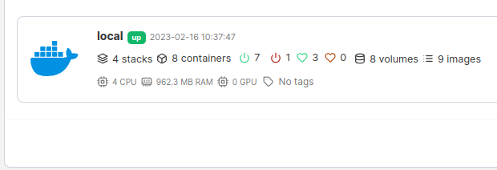
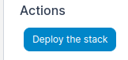
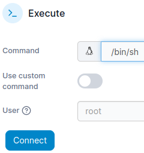
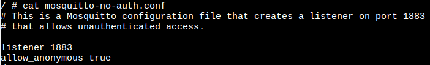
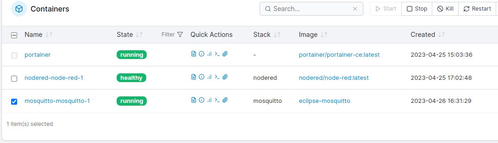
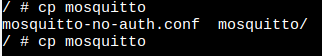

# MQTT broker installeren

*Een MQTT broker is een programma waarmee we gegevens kunnen uitwisselen tussen verschillende computers of sensoren.*

### Inhoud

```@contents
Pages = ["chapter7.md"]
```

## Wat je nodig hebt

- Een Raspberry Pi 3B+ met het besturingssysteem Ubuntu Server 22.04.
- Docker, Portainer en Node-RED zijn geinstalleerd.

## Wat je gaat doen

Stap 1: ChatGPT om docker-compose.yml bestand vragen.

Stap 2: Installeren Mosquittto.

Stap 3: Toegang aan iedereen geven.

## Stap 1 - ChatGPT om docker-compose.yml bestand vragen

Stel de volgende vraag aan chatGPT: maak een docker-compose.yml bestand voor mosquitto.

Ik kreeg als antwoord:

### docker-compose.yml
```
version: '3'
services:
  mosquitto:
    image: eclipse-mosquitto
    ports:
      - "1883:1883"
    volumes:
      - mosquitto-data:/mosquitto/data
      - mosquitto-config:/mosquitto/config
    restart: unless-stopped

volumes:
  mosquitto-data:
  mosquitto-config:
```

Deze configuratie maakt gebruik van de officiële Eclipse Mosquitto Docker-afbeelding (image) en maakt verbinding op poort 1883. Het configureert ook twee Docker-volumes voor de gegevens en configuratie van Mosquitto, zodat deze na het verwijderen van de container behouden blijven.

## Stap 2 - Installeren Mosquittto

|Stap        | Actie      |
|:---------- | :---------- |
| 1 | Kopieeer de gegevens uit [docker-compose.yml](#docker-compose.yml) naar het klembord. |
| 2 | Open de browser en type in de adresbalk: `IP-adres_Raspberry_Pi:9000`. Dit zorgt dat je Portainer in je browser opent. |
| 3 | Zoek in de browser naar "stacks" en klik erop. Hierdoor opent het menu. ``\\``|
| 4 | Klik in het menu op "Stacks" om een overzicht te zien. ``\\`` |
| 5 | Klik op de knop "Add Stack".  |
| 6 | Geef de Stack een naam door `mosquitto` in het veld "Name" te typen. | 
| 7 | Klik op de eerste regel in het veld "Web-editor" en plak de tekst van het klembord door Ctrl + V te drukken. ``\\`` |
| 8 | Klik op de knop "Deploy the stack" die onderaan de pagina staat.``\\`` |
| 9 | Ga naar het menu "containers" en kijk of de container begint .|
||

En dat is het! Je zou nu een werkende Mosquitto MQTT-broker moeten hebben binnen een Docker stack die beheerd wordt door Portainer. 

### Stap 3 - Toegang aan iedereen geven

|Stap        | Actie      |
|:---------- | :---------- |
| 1 | Open het programma Protainer en ga naar "Containers". |
| 2 | We gaan iets veranderen in de Mosquitto-instellingen zodat iedereen erbij kan. Klik op het vierde plaatje achter "mosquitto-mosquitto-1" om in de container naar binnen te gaan. ``\\`` |
| 3 | Kies in het veld "Command" voor "/bin/sh". Druk op de knop "Connect". ``\\`` |
| 4 | Genereer een lijst met folders en de bestanden, typ: `ls -l`. Je ziet het bestand "mosquitto-no-auth.conf". |
| 5 | Als je wilt weten wat er in het bestand staat, typ dan `cat mosquitto-no-auth.conf` en druk op de toets "Enter". De zin "allow\_anonymous true" betekent dat je niet hoeft in te loggen. ``\\`` |
| 6 | We gaan het bestand kopiëren naar de map "/mosquitto/config/". Typ hiervoor: `cp mosquitto-no-auth.conf /mosquitto/config/mosquitto.conf`. |
| 7 | Verlaat de contaner met "Ctrl+D". |
| 8 | Vink het hokje aan voor de container en klik op de knop "Restart". ``\\`` 
||

!!! info "Tip"
    #### Auto-complete/Automatisch aanvulling
    In Linux is er een handige functie die auto-complete heet en die je helpt om sneller en makkelijker commando's in te typen in de terminal. Stel je voor dat je een lang woord moet typen, zoals "cp mosquitto-no-auth.conf /mosquitto/config/mosquitto.conf". In plaats van het hele woord te typen, kun je de eerste paar letters typen, zoals "cp mo", en dan op de tab-toets drukken. Linux zal dan het woord "cp mo" automatisch voor je afmaken als er geen andere woorden zijn die met "mo" beginnen. Als je de tweede keer op de tab-toets drukt, dan krijg je een overzicht van alle mogelijke woorden die beginnen met "mosquitto". In ons geval zie je dan bijvoorbeeld "mosquitto-no-auth.conf" en "mosquitto/": ``\\``    
    

    Als je daarna op de "-" toets drukt gevolgd door de tab-toets, dan maakt Linux het hele woord voor je af. Dit bespaart tijd en voorkomt fouten als je lange woorden moet typen. Auto-complete is dus een handige functie die het werken in de terminal veel makkelijker en sneller maakt.

    Een command breek je af met "Ctrl+C".

## Samenvatting

In deze les leer je hoe je Mosquitto installeert, een programma dat helpt bij het delen van informatie tussen verschillende computers en sensoren. Om dit te doen heb je een Raspberry Pi 3B+ met Ubuntu Server 22.04 besturingssysteem nodig en de programma's Docker, Portainer en Node-RED. Je moet de inhoud van een bestand genaamd "docker-compose.yml" in Portainer plakken om Mosquitto te kunnen installeren. Vervolgens moet je een paar instellingen aanpassen, zodat programma's niet hoeven in te loggen. Dit doe je door het bestand "mosquitto-no-auth.conf" te kopiëren naar een speciale map en de container opnieuw op te starten. En kijk, je hebt nu een werkende MQTT-broker die informatie kan delen tussen verschillende apparaten!