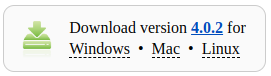
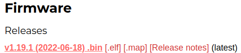
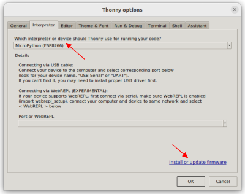
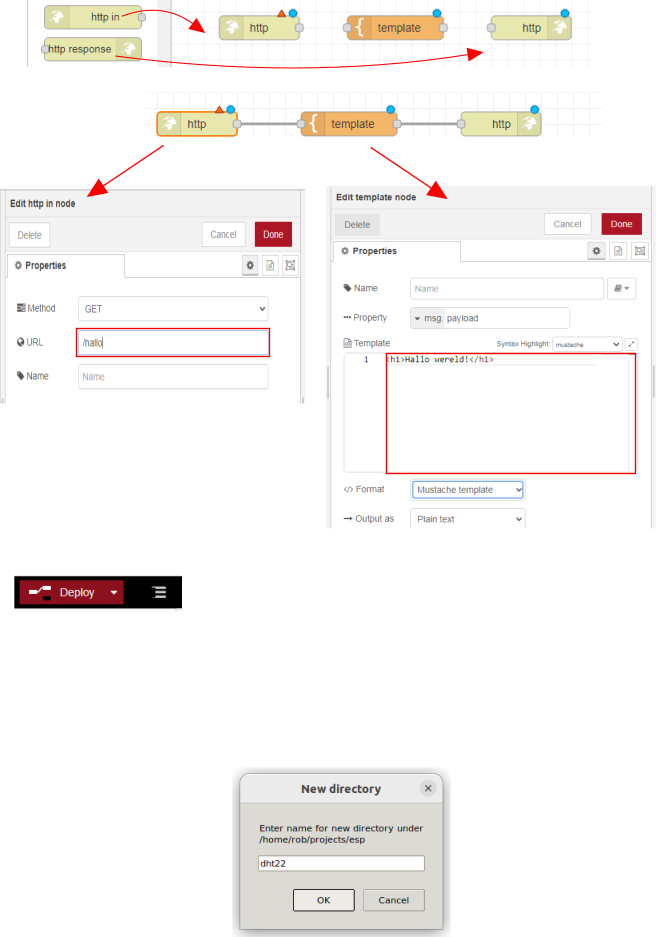
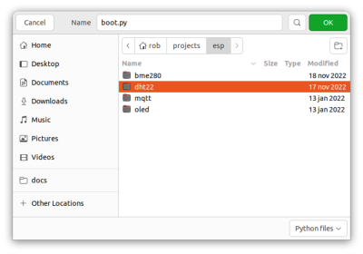
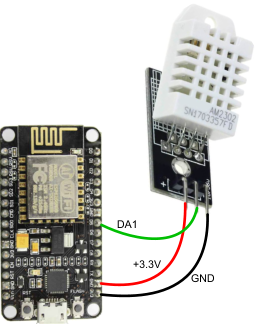
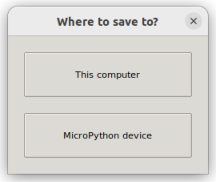
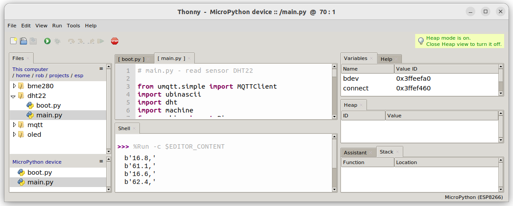

# Temperatuur meten

*We gaan de temperatuur meten met een ESP8266 en een DHT22. De ESP8266 is een klein computerboardje waarmee we gegevens kunnen versturen en ontvangen via wifi. De DHT22 is een sensor die we kunnen gebruiken om de temperatuur en luchtvochtigheid te meten.*

### Inhoud

```@contents
Pages = ["chapter8.md"]
```

## Wat je nodig hebt

- [ESP8266](https://elektronicavoorjou.nl/product/nodemcu-esp8266-wifi-board/).
- [DHT22](https://elektronicavoorjou.nl/product/dht22-temp-vocht-sensor/).
- [USB A naar Micro USB kabel](https://elektronicavoorjou.nl/product/micro-usb-kabel-1m/).
- [Voeding voor de ESP8266](https://elektronicavoorjou.nl/product/raspberry-pi-3b-voedingsadapter-micro-usb-schakelaar/).
- [Thonny](https://thonny.org/).

Thonny is een softwareprogramma speciaal gemaakt voor kinderen en beginners om te programmeren. Het is eenvoudig te gebruiken en biedt hulpmiddelen die het makkelijker maken om te leren programmeren. Het is bedoeld om jou te helpen leren hoe je computers kunt laten doen wat jij wilt door het schrijven van code.

## Wat je gaat doen

Stap 1: Download en installeer Thonny.

Stap 2: Zet Thonny klaar voor het gebruik met de ESP8266.

Stap 3: Voeg programma's toe aan Thonny.

Stap 4: Stuur de programma's naar de ESP8266.

## Stap 1 - Download en installeer Thonny

Om Thonny te installeren, moet je de volgende stappen volgen:

|Stap        | Actie      |
|:---------- | :---------- |
| 1 | De Thonny-website is te vinden op [https://thonny.org](https://thonny.org/). Klik op de link om er naar toe te gaan. |
| 2 | Klik op de juiste Download link om het installatiebestand te downloaden. ``\\`` |
| 3 | Ga naar de map waarin het installatiebestand is gedownload en dubbelklik op het bestand. |
| 4 | Volg de stappen in de installatie-wizard om Thonny te installeren op je computer. |
| 5 | Nadat de installatie is voltooid, kun je Thonny openen door op het icoon te klikken dat is gemaakt op je bureaublad of door het te vinden via het startmenu. |
| 6 | En daar heb je het! Nu kun je Thonny gebruiken om te programmeren en te leren hoe computers werken. Veel plezier! |
||

## Stap 2 - Zet Thonny klaar voor het gebruik met ESP8266.

|Stap        | Actie      |
|:---------- | :---------- |
| 1 | Ga naar de website van [MicroPython downloads](https://micropython.org/download/) door op de link te klikken. |
| 2 | Zoek naar het plaatje met de tekst `ESP8266 with 2MiB+ flash Espressif`. ``\\``|
| 3 | Klik op de link in het plaatje. |
| 4 | Zoek in de lijst naar het nieuwste item. Download die dan. Het voordeel van de laatste versie is dat de software voor de DHT22 ook toegevoegd is. Bij mij was dat op 6 febr. 2023: ``\\`` |
| 5 | Start Thonny op. |
| 6 | Druk op "Tools > Options..." en ga naar de tab "Interpreter". |
| 7 | Kies als interpreter/device "MicroPython (ESP8266)". ``\\``. |
| 8 | Klik op de link "Install or update".|
| 9 | Kies in het veld genaamd "Firmware" het bestand dat je in stap 4 hebt gedownload, bijvoorbeeld `esp8266-20220618-v1.19.1.bin`. ``\\``. |
| 10 | Druk op de knop Install.| 

## Stap 3 - Voeg programma's toe aan Thonny

[Meer documentatie ESP8266](https://docs.micropython.org/en/latest/esp8266/quickref.html).

We hebben twee bestanden met Python software nodig: `boot.py` en `main.py`. We zetten beide bestanden in een folder "dht22" op de laptop.

|Stap        | Actie      |
|:---------- | :---------- |
| 1 | Selecteer de code in [boot.py](#boot.py) en kopieer het naar het klembord met "Ctrl-C". |
| 2 | Maak een nieuwe map door met je rechtermuisknop te klikken in het meest linkse venster "Files" en "New directory..." te kiezen. Als je dat venster niet kunt zien, klik dan eerst op "View > Files" in het menu. |
| 3 | Typ "dht22" en druk op OK. ``\\`` |
| 4 | Maak een leeg bestand met "Ctrl + N". |
| 5 | Plak de code die je hebt gekopieerd in stap 1 in het lege venster door op "Ctrl + V" te drukken. |
| 6 | Vul op regel 6 de naam van jouw wifi-netwerk en het bijbehorende wachtwoord in. |
| 7 | Sla het bestand op door "Ctrl + S" te drukken, kies de map "dht22" en geef het bestand de naam "boot.py". ``\\`` |
| 8 | Herhaal stap 1 en 4 voor [main.py](#main.py). |
| 9 | In regel 12 van de code moet je het woord **IP\_adres\_Raspberry\_Pi** veranderen in het echte IP-adres van jouw Raspberry Pi, bijvoorbeeld: `192.168.2.49`. Het is belangrijk om te weten dat de aanduidingen om de DHT22 te verbinden kunnen verschillen bij elke DHT22. |
| 10 | Sla het bestand op door op "Ctrl + S" te drukken, kies de map "dht22" en geef het bestand de naam "main.py". |
| 11 | Sluit Thonny. |
||


### boot.py
```
# boot.py - connect to wifi
def connect():
    import network
    station = network.WLAN(network.STA_IF)
    if not station.isconnected():
        station.active(True)
        station.connect('Naam_wifi_netwerk', 'Wachtwoord_wifi_netwerk)
        while not station.isconnected():
            pass # wait till connection
    print('network config:', station.ifconfig())
    
connect()
```

Dit is een stuk code geschreven in de programmeertaal Python. Het doel van de code is om je microcontroller (bijvoorbeeld een ESP8266 of ESP32) te verbinden met een wifi-netwerk.

De code bevat één functie, die 'connect' heet. Als we deze functie aanroepen, zal de microcontroller verbinding maken met het wifi-netwerk met de naam 'Naam\_wifi\_netwerk' en het wachtwoord 'Wachtwoord\_wifi\_netwerk'.

Als de verbinding is gemaakt, zal het IP-adres dat is toegewezen aan de microcontroller worden weergegeven.

### main.py
```
# main.py - read sensor DHT22

from umqtt.simple import MQTTClient
import ubinascii
import dht
import machine
from machine import Pin
import time

# mqtt client setup
client_id = ubinascii.hexlify(machine.unique_id())
mqtt_server = 'IP_adres_Raspberry_Pi'

last_message = 0
message_interval = 5

topic_pub_temp = b'temperature2'
topic_pub_hum = b'humidity2'

sensor = dht.DHT22(Pin(14))

def connect_mqtt():
  global client_id, mqtt_server
  mqttc = MQTTClient(client_id, mqtt_server, keepalive=60)
  mqttc.connect()
  return mqttc

def restart_and_reconnect():
  print('Failed to connect to MQTT broker. Reconnecting...')
  time.sleep(10)
  machine.reset()

def read_sensor():
  try:
    sensor.measure()
    # uncomment for Fahrenheit
    #temp = temp * (9/5) + 32.0
    temp = sensor.temperature()
    hum = sensor.humidity()
    if (isinstance(temp, float) and isinstance(hum, float)) or (isinstance(temp, int) and isinstance(hum, int)):
      temp = (b'{0:3.1f},'.format(temp))
      hum =  (b'{0:3.1f},'.format(hum))
      return temp, hum
    else:
      return('Invalid sensor readings.')
  except OSError as e:
    return('Failed to read sensor.')

try:
  client = connect_mqtt()
except OSError as e:
  restart_and_reconnect()

while True:
  try:
    if (time.time() - last_message) > message_interval:
      temp, hum = read_sensor()
      print(temp)
      print(hum)
      client.publish(topic_pub_temp, temp[:-1])
      client.publish(topic_pub_hum, hum[:-1])
      last_message = time.time()
  except OSError as e:
    restart_and_reconnect()
```

Het doel van de code is om gegevens te lezen van een sensormodule die DHT22 heet en deze vervolgens publiceert via MQTT.

De code maakt gebruik van een microcontroller (bijvoorbeeld een ESP8266 of ESP32), en leest elke 5 seconden de temperatuur en luchtvochtigheid van de sensor DHT22. Deze gegevens worden vervolgens naar een MQTT-broker verzonden, waar ze kunnen worden opgehaald door andere apparaten die zijn verbonden met hetzelfde netwerk.

De MQTT-broker heeft een IP-adres 'IP_adres_Raspberry_Pi' en de gegevens worden gepubliceerd op twee verschillende topics: 'temperature2' voor de temperatuur en 'humidity2' voor de luchtvochtigheid.

Als er tijdens het verzenden van gegevens een fout optreedt, zal de code proberen om opnieuw verbinding te maken met de MQTT-broker. Als dit na 10 seconden nog steeds niet lukt, wordt de microcontroller opnieuw gestart.

## Stap 4 - Stuur de programma's naar de ESP8266

```@raw html

```
*De [ESP8266 12-E NodeMCU kit pinout diagram](https://randomnerdtutorials.com/esp8266-pinout-reference-gpios/) volgens Random Nerd Tutorials*

|Stap        | Actie      |
|:---------- | :---------- |
| 1 | Verbind de DHT22 met de ESP8266 (DA1 met GPIO14 => sensor = dht.DHT22(Pin(14)) en sluit de ESP8266 aan op de laptop met de "USB A naar Micro USB" kabel. ``\\``  |
| 2 | Open het programma Thonny op de laptop. Als het programma al loopt, klik dan eventueel op het "Stop" symbool in het menu of druk op "Ctrl + F2". |
| 3 | Ga naar de map "dht22" en kies `boot.py`. |
| 4 | Kies "File > Save as..." in het menu om het bestand op te slaan. Er verschijnt dan een pop-up met: **Where to save to?**.``\\`` |
| 5 | Klik op de knop die "MicroPython device" heet. |
| 6 | Plaats het bestand "main.py" op dezelfde manier op de ESP8266. |
| 7 | Klik op de groene knop met de pijl rechts of druk op "F5" om de code te laten werken. Je ziet op het scherm de temperatuur in graden Celsius en de hoeveelheid vocht in de lucht in procenten verschijnen, één voor één. ``\\`` |
||


## Samenvatting

Dit hoofdstuk gaat over het meten van temperatuur en luchtvochtigheid met behulp van een computerbordje genaamd ESP8266 en een sensor genaamd DHT22. Thonny is een eenvoudig te gebruiken softwareprogramma dat kinderen en beginners helpt om te leren programmeren. Om te beginnen moet je Thonny downloaden en installeren. Vervolgens moet je Thonny klaarzetten voor gebruik met de ESP8266. Dit omvat het downloaden van de nieuwste firmware en het instellen van de interpreter in Thonny. Vervolgens moet je twee bestanden met Python-software `boot.py` en `main.py` downloaden en deze in een map genaamd dht22 op je computer opslaan. In `boot.py` vul je de naam van jouw wifi-netwerk en het bijbehorende wachtwoord in. Nadat alle stappen zijn voltooid, kun je programma's naar de ESP8266 sturen en de temperatuur en luchtvochtigheid meten.