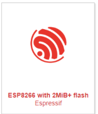
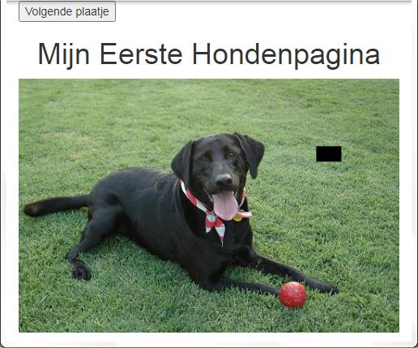

# Temperatuur meten

*We gaan de temperatuur meten met een ESP8266 en een DHT22. De ESP8266 is een klein computerboardje waarmee we gegevens kunnen versturen en ontvangen via WiFi. De DHT22 is een sensor die we kunnen gebruiken om de temperatuur en luchtvochtigheid te meten.*

### Contents

```@contents
Pages = ["chapter8.md"]
```

## Wat je nodig hebt

- [ESP8266](https://elektronicavoorjou.nl/product/nodemcu-esp8266-wifi-board/)
- [DHT22](https://elektronicavoorjou.nl/product/dht22-temp-vocht-sensor/)
- [USB A naar Micro USB kabel](https://elektronicavoorjou.nl/product/micro-usb-kabel-1m/)
- [Thonny](https://thonny.org/)

Thonny is een softwareprogramma speciaal gemaakt voor kinderen en beginners om te programmeren. Het is eenvoudig te gebruiken en biedt hulpmiddelen die het makkelijker maken om te leren programmeren. Het is bedoeld om jou te helpen leren hoe je computers kunt laten doen wat jij wilt door het schrijven van code.

## Wat je gaat doen

- Stap 1: Installeren Thonny.
- Stap 2: Thonny instellen voor de ESP8266.
- Stap 3: Software op ESP8266 zetten.

## Stap 1 - Installeren Thonny

Om Thonny te installeren, moet je de volgende stappen volgen:

1. Open een webbrowser en zoek naar de [Thonny-website](https://thonny.org/).
2. Klik op de knop "Download" om het installatiebestand te downloaden.
3. Ga naar de map waarin het installatiebestand is gedownload en dubbelklik op het bestand.
4. Volg de stappen in de installatie-wizard om Thonny te installeren op je computer.
5. Nadat de installatie is voltooid, kun je Thonny openen door op het icoon te klikken dat is gemaakt op je bureaublad of door het te vinden via het startmenu.
6. En daar heb je het! Nu kun je Thonny gebruiken om te programmeren en te leren hoe computers werken. Veel plezier!

Stap 3, het installeren van de ESP8266-driver, is belangrijk om verbinding te maken tussen de ESP8266 en je computer via de USB-kabel. Hier is een gedetailleerde uitleg:

Ga naar de Thonny-website: Ga naar de Thonny-website en klik op de knop "Download".

Download de ESP8266-driver: Klik op de link naar de downloadpagina voor de ESP8266-driver en download het bestand.

Installeer de driver: Dubbelklik op het gedownloade bestand en volg de stappen in de installatiewizard om de ESP8266-driver te installeren. Het is belangrijk dat je de wizard tot het einde doorloopt om ervoor te zorgen dat de driver correct geïnstalleerd is.

Controleer of de driver geïnstalleerd is: Ga naar "Apparaatbeheer" op je computer en controleer of de ESP8266 in de lijst staat met "USB-apparaten". Als je de driver correct hebt geïnstalleerd, moet het apparaat worden herkend door je computer.

Dit zijn de stappen om de ESP8266-driver te installeren en te controleren of deze correct is geïnstalleerd. Na het installeren van de driver kun je verder gaan met de volgende stappen in Thonny.

## Stap 2 - Thonny instellen voor de ESP8266

[MicroPython downloads](https://micropython.org/download/)

|Stap        | Actie      |
|:---------- | :---------- |
| 1 | Ga naar [MicroPython downloads](https://micropython.org/download/) |
| 2 | Zoek naar naar het plaatje met de tekst `ESP8266 with 2MiB+ flash Espressif`. ``\\``|
| 3 | Klik op de link in het plaatje. |
| 4 | Kies uit de lijst voor de laatste release en download het. ``\\``Bij mij was dat: `v1.19.1 (2022-06-18) .bin [.elf] [.map] [Release notes] (latest)`. ``\\``Het voordeel van de laatste versie is dat de software voor de DHT22 ook geinstalleerd is. |
| 8 | Klik op de link `Install or update`|
| 5 | Start Thonny op |
| 6 | Klik op `Tools > Options...` en ga naar de Tab `Interperter` |
| 7 | Kies als Interperter voor `MicroPython (ESP8266)` ``\\``. ``\\``*Tijdelijk plaatje! Ik ga elke stap ervan voorzien.* |
| 9 | Kies in het veld `firmware` voor het bestand dat je in stap 4 hebt gedownload, bijvoorbeeld `esp8266-20220618-v1.19.1.bin`. |
| 10 | Klik op de knop `Install` | 

## Stap 3 - Software op ESP8266 zetten

[Documentatie ESP8266](https://docs.micropython.org/en/latest/esp8266/quickref.html).

```
# boot.py - connect to WiFi
def connect():
    import network
    station = network.WLAN(network.STA_IF)
    if not station.isconnected():
        station.active(True)
        station.connect('Naam_wifi_netwerk', 'Wachtwoord_wifi_netwerk)
        while not station.isconnected():
            pass # wait till connection
    print('network config:', station.ifconfig())
    
connect()
```

Dit is een stuk code geschreven in de programmeertaal Python. Het doel van de code is om je microcontroller (bijvoorbeeld een ESP8266 of ESP32) te verbinden met een WiFi-netwerk.

De code bevat één functie, genaamd 'connect'. Als we deze functie aanroepen, zal de microcontroller verbinding maken met het WiFi-netwerk met de naam 'Naam_wifi_netwerk' en het wachtwoord 'Wachtwoord_wifi_netwerk'.

Als de verbinding is gemaakt, zal het IP-adres dat is toegewezen aan de microcontroller worden weergegeven.

```
# main.py - read sensor DHT22

from umqtt.simple import MQTTClient
import ubinascii
import dht
import machine
from machine import Pin
import time

# mqtt client setup
client_id = ubinascii.hexlify(machine.unique_id())
mqtt_server = 'IP_adres_Raspberry_Pi'

last_message = 0
message_interval = 5

topic_pub_temp = b'temperature2'
topic_pub_hum = b'humidity2'

sensor = dht.DHT22(Pin(14))

def connect_mqtt():
  global client_id, mqtt_server
  mqttc = MQTTClient(client_id, mqtt_server, keepalive=60)
  mqttc.connect()
  return mqttc

def restart_and_reconnect():
  print('Failed to connect to MQTT broker. Reconnecting...')
  time.sleep(10)
  machine.reset()

def read_sensor():
  try:
    sensor.measure()
    # uncomment for Fahrenheit
    #temp = temp * (9/5) + 32.0
    temp = sensor.temperature()
    hum = sensor.humidity()
    if (isinstance(temp, float) and isinstance(hum, float)) or (isinstance(temp, int) and isinstance(hum, int)):
      temp = (b'{0:3.1f},'.format(temp))
      hum =  (b'{0:3.1f},'.format(hum))
      return temp, hum
    else:
      return('Invalid sensor readings.')
  except OSError as e:
    return('Failed to read sensor.')

try:
  client = connect_mqtt()
except OSError as e:
  restart_and_reconnect()

while True:
  try:
    if (time.time() - last_message) > message_interval:
      temp, hum = read_sensor()
      print(temp)
      print(hum)
      client.publish(topic_pub_temp, temp[:-1])
      client.publish(topic_pub_hum, hum[:-1])
      last_message = time.time()
  except OSError as e:
    restart_and_reconnect()
```

Het doel van de code is om gegevens te lezen van een sensormodule die DHT22 heet en deze vervolgens publiceert via MQTT.

De code maakt gebruik van een microcontroller (bijvoorbeeld een ESP8266 of ESP32), en leest elke 5 seconden de temperatuur en luchtvochtigheid van de sensor DHT22. Deze gegevens worden vervolgens naar een MQTT-broker verzonden, waar ze kunnen worden opgehaald door andere apparaten die zijn verbonden met hetzelfde netwerk.

De MQTT-broker heeft een IP-adres 'IP_adres_Raspberry_Pi' en de gegevens worden gepubliceerd op twee verschillende topics: 'temperature2' voor de temperatuur en 'humidity2' voor de luchtvochtigheid.

Als er tijdens het verzenden van gegevens een fout optreedt, zal de code proberen om opnieuw verbinding te maken met de MQTT-broker. Als dit na 10 seconden nog steeds niet lukt, wordt de microcontroller opnieuw gestart.

## Samenvatting
