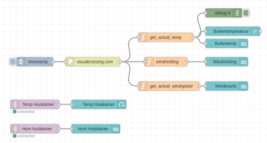

# Node-RED dashboard programma maken

Deze module geeft je een set nodes (knooppunten) in [Node-RED](https://flows.nodered.org/node/node-red-dashboard) waarmee je snel een live data dashboard kunt maken.

Je gaat een [dashboard](https://flows.nodered.org/node/node-red-dashboard) maken dat de volgende dingen laat zien:
- Hoe warm het is en hoe vochtig de lucht in huis is.
- Hoe de temperatuur buiten verandert.
- Hoe hard de wind waait en in welke richting.

 

### Inhoud

```@contents
Pages = ["chapter9.md"]
```

## Wat je nodig hebt

- Een Raspberry Pi 3B+ met het besturingssysteem Ubuntu Server 22.04.
- Docker, Portainer, Node-RED en MQTT broker zijn geinstalleerd.
- Een ESP8266 met een DHT22 die gegevens stuurt naar de MQTT broker.
- Een wifi netwerk waar de hierboven genoemde delen op zijn aangesloten.

## Wat je gaat doen

- Stap 1: De Node-RED Dashboard module downloaden.
- Stap 2: Het dashboard samenstellen.
- Stap 3: Weergegevens ophalen en op dashboard weergeven.

## Stap 1 - De Node-RED Dashboard module downloaden

## Stap 2 - Het dashboard samenstellen

## Stap 3 - Weergegevens ophalen en op dashboard weergeven

## Samenvatting