# Node-RED dashboard programma maken

Deze module geeft je een set nodes (knooppunten) in [Node-RED](https://flows.nodered.org/node/node-red-dashboard) waarmee je snel een live data dashboard kunt maken.

Je gaat een dashboard maken dat de volgende dingen laat zien:
- Hoe warm het is en hoe vochtig de lucht in huis is.
- Hoe de temperatuur buiten verandert.
- Hoe hard de wind waait en vanuit welke richting.

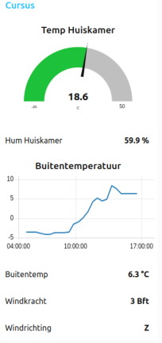

### Inhoud

```@contents
Pages = ["chapter9.md"]
```

## Wat je nodig hebt

- Een Raspberry Pi 3B+ met het besturingssysteem Ubuntu Server 22.04.
- Docker, Portainer, Node-RED en MQTT broker zijn geinstalleerd.
- Een ESP8266 met een DHT22 die gegevens stuurt naar de MQTT broker.
- Een wifi netwerk waar de hierboven genoemde delen op zijn aangesloten.

## Wat je gaat doen

Stap 1: De Node-RED Dashboard module downloaden.

Stap 2: Het dashboard samenstellen.

Stap 3: Weergegevens ophalen en op dashboard weergeven.

## Stap 1 - De Node-RED Dashboard module downloaden

Node-RED heeft al veel verschillende soorten knoppen, maar soms wil je iets extra's. Dat kan door het toevoegen van nieuwe knoppen. Een populaire toevoeging is de [dashboard](https://flows.nodered.org/node/node-red-dashboard) module. Deze module bestaat uit verschillende knoppen die speciaal zijn gemaakt voor het maken van dashboards. Bijvoorbeeld, er is een knop voor het laten zien van een gegeven in een meter of gegevens in een grafiek. Ook is er een knop voor het laten zien van gegevens als tekst. De module moet je toevoegen, het wordt namelijk niet standaard meegeleverd:

|Stap        | Actie      |
|:---------- | :---------- |
| 1 | Klik op het menu in de rechter bovenhoek en ga naar "Manage Palette". |
| 2 | Zoek in de zoekbalk naar "node-red-dashboard" en klik op het resultaat. |
| 3 | Klik op de witte knop "Install" om de dashboard nodes te installeren. |
| 4 | Je krijgt een melding. Klik op de rode knop met "Install" om de dashboard nodes te installeren. |
| 5 | Na het installeren kun je de dashboard nodes vinden in het linkermenu onder de categorie "dashboard". |
||

## Stap 2 - Het dashboard samenstellen

Als je het adres `IP_adres_raspberry_pi:1880/ui` intypt in je web browser, kan je gegevens zien van de "dashboard module". We zullen verwijzen naar de MQTT broker met het onderwerp (topic) "temperatuur2".
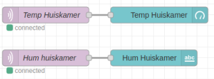.

Volg deze stappen om het werk te doen:
 
|Stap        | Actie      |
|:---------- | :---------- |
| 1 | Sleep de node "mqtt in" uit de groep "network" naar je werkblad. |
| 2 | Sleep de node "gauge" uit de groep "dashboard" naar je werkblad en maak verbinding met "mqtt in". |
| 3 | Dubbelklik op "mqtt in" en typ het IP adres van je Raspberry Pi in het vak "Server". Bijvoorbeeld: 192.168.2.49. |
| 4 | Typ in het vak "Topic" het woord `temperatuur2`. |
| 5 | Typ in het vak "Name" de zin `Temp huiskamer`. |
| 6 | Sleep de node "mqtt in" uit de groep "network" naar je werkblad. |
| 7 | Sleep de node "text" uit de groep "dashboard" naar je werkblad en maak verbinding met "mqtt in". |
| 8 | Dubbelklik op "mqtt in" en typ het adres van je Raspberry Pi in het vak "Server". Bijvoorbeeld: 192.168.2.49. |
| 9 | Typ in het vak "Topic" het woord `humidity2`. |
| 10 | Typ in het vak "Name" de zin `Hum huiskamer`. |
| 11 | Dubbelklik op "Text" en typ in het vak "Value format" `{{msg.payload}} %`. |
| 12 | Kies bij "Layout" voor het vierde voorbeeld. |
| 13 | Klik op de knop "Deploy" om de code te maken. |  
| 14 | Typ in de adresbalk van je browser `IP_adres_raspberry_pi:1880/ui` en druk op Enter. |
||


## Stap 3 - Weergegevens ophalen en op dashboard weergeven

We gaan weergegevens over Leusden ophalen van een website die "Visual Crossing" heet. Hiervoor moeten we eerst een account maken op de website. Als we een account hebben, krijgen we een "API key". Dit is een soort code die we nodig hebben om de informatie op te halen. We hebben in onze les "Website bouwen met Node-RED" al geleerd hoe je met een API omgaat. We mogen de informatie gratis opvragen, maar we moeten er wel voor zorgen dat we niet te vaak op een dag informatie opvragen. Als we het opvragen van informatie onder de 1000 keer per dag houden, is het gratis. Ik vraag zelf de informatie elke 15 minuten op, dus ik vraag het in totaal 4 x 24 = 96 keer per dag op, dus veel minder dan het maximum.

!!! info
    Zorg dat je je persoonlijke "API key" klaar hebt liggen voordat je de steppen gaat uitvoeren.

|Stap        | Actie      |
|:---------- | :---------- |
| 1 | Sleep de nodes "timestamp", "http request", "debug", 3x "function" en uit de groep dashboard "chart" en 3x "text". Confiugreer de nodes volgens onderstaand schema. ``\\``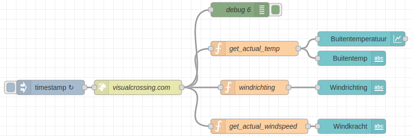 |
| 2 | Dubbelkik op "timestamp" ``\\``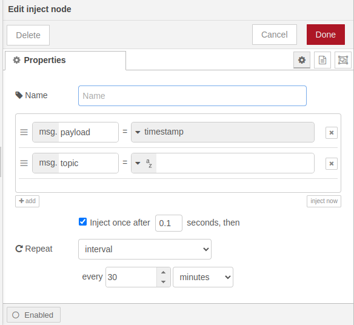|
| 3 | Klik op het keuzevakje `once after`. |
| 4 | Kies bij de Repeat groep voor: `interval`. |
| 5 | Type in het veld "every": `30`. | 
| 6 | Kies als eenheid: `minutes`. |
| 7 | Druk op de toets "Done". |
| 7 | Dubbelklik op "http request". ``\\``|
| 8 | Type in het veld "URL": https://weather.visualcrossing.com/VisualCrossingWebServices/rest/services/timeline/Leusden?unitGroup=metric&key=**JOUW\_API\_KEY**&contentType=json
| 9 | Kies in het keuze veld "Return" voor: `a parsed JSON object`.
| 10 | Druk op de toets "Done". |
| 11 | Debug ontvangt van de node "visualcrossing" een JSON object zodra je op het meest linkse grijze vierkantje klikt van timestamp. Een subgroep is "currentConditions". Dit bevat de gegevens die we willen gebruiken op het dashboard. Je krijgt ze te zien als je in het venster geheel rechts kies voor de tweede tab van rechts "Debug messages". ``\\``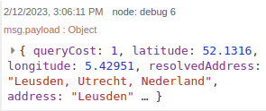``\\``*Klik op het driehoekjes om het volledige JSON object te bekijken.*|
| 12 | Dubbelklik op de eerste "functie" en geef het de naam: `buitentemp`. ``\\``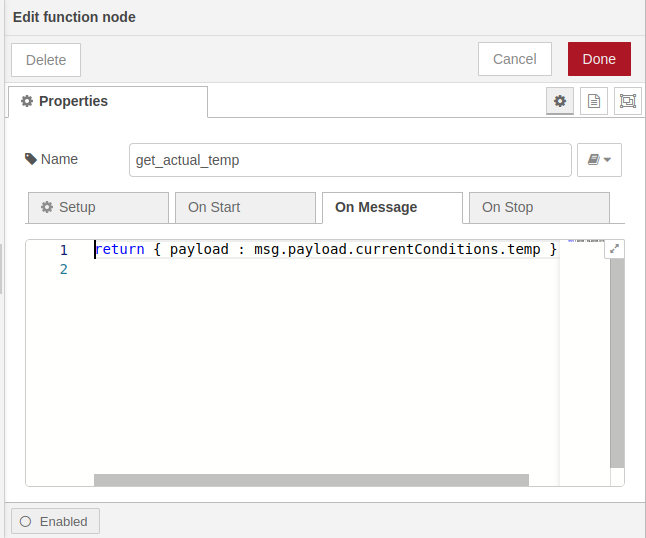 ``\\``*Wat je hier ziet is JavaScript code. Elke uitdukking eindigt met een ";". Iets ingesloten door accolades {...} verwijst naar een JSON-object.* |
| 13 | Typ op de eerste regel: `return { payload : "msg.payload.currentConditions.temp };`. "temp" is de buitentemperatuur. ``\\``Een payload is een belangrijk onderdeel van computers en technologie. Het is een term die gebruikt wordt om iets te beschrijven dat wordt verstuurd via internet, een computer-netwerk of in ons geval in een Node-RED flow. Denk bijvoorbeeld aan het versturen van een e-mail naar iemand. De boodschap die je verstuurt, bijvoorbeeld je tekst en eventuele afbeeldingen, is de payload. Het wordt verzonden via het internet naar de ontvanger, zoals jij wilt dat het wordt ontvangen. ``\\``Met "msg.payload" wordt verwezen naar het bericht wat Visual Crossing verzendt. Het vervolg ".currentConditions.temp" verwijst naar de buitentemperatuur. ``\\``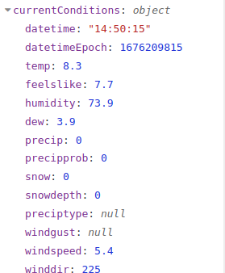 |
| 14 | Druk op de toets "Done". |
| 15 | Dubbelklik op de tweede "functie" en geef het de naam: "windrichting". ``\\``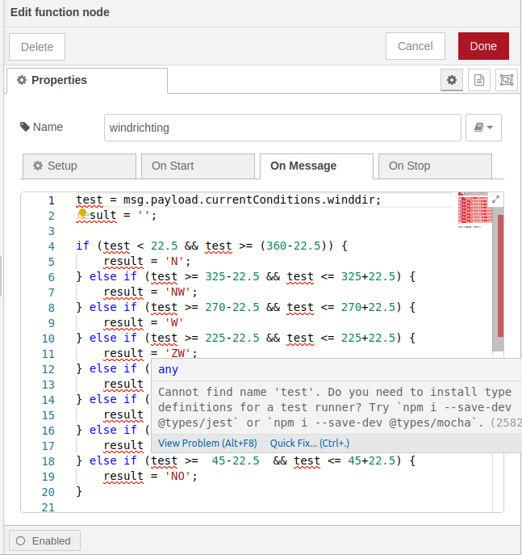 |
| 16 | Kopieer de tekst uit ["Javascript code windrichting"](#Javascript-code-windrichting) naar het code blok.
| 17 | Druk op de toets "Done". |
| 18 | Dubbelklik op de derde "functie" en geef het de naam: "windsnelheid".  ``\\``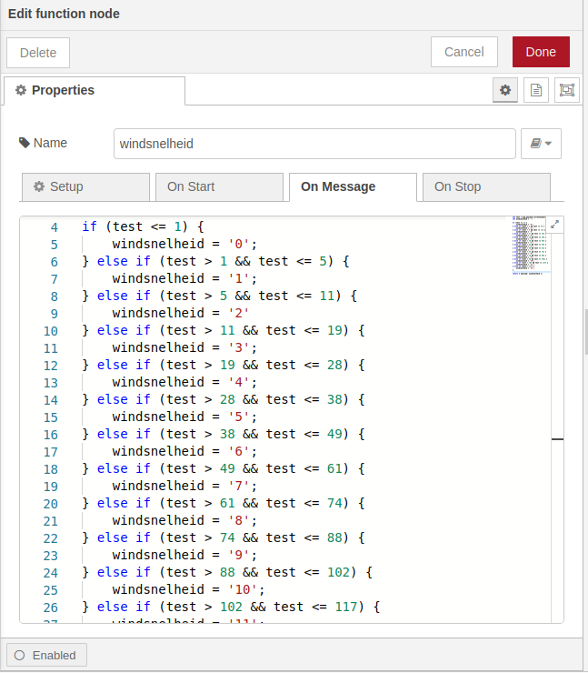| |
| 19 | Kopieer de tekst uit [Javascript code windsnelheid in Beaufort](#Javascript-code-windsnelheid-in-Beaufort). Hiermee converteren we de windsnelheid (km/uur) naar Beaufort. De tabel vind je [hier](https://www.kuijntjes.nl/weer/windsnelheid.htm).
| 20 | Druk op de toets "Done". |
| 21 | Druk op de knop "Deploy". |
| 22 | Druk op de laatste tab rechts en kies voor "Dashboard". ``\\``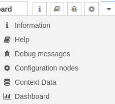 |
| 23 | Klik in de groep "Tab & Links" op de tab "+tab". ``\\``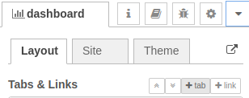 |
| 24 | Druk op de "edit" knop om de tab te openen. ``\\``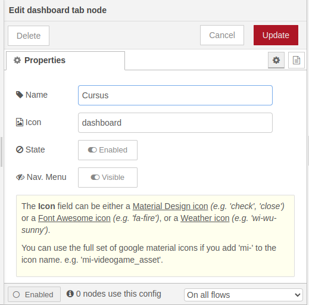 |
| 25 | Verander de naam van de tab in: "Cursus". |
| 26 | Druk op de toets "Update". |
| 27 | Klik op de tab en je ziet alle Dashboard items. ``\\``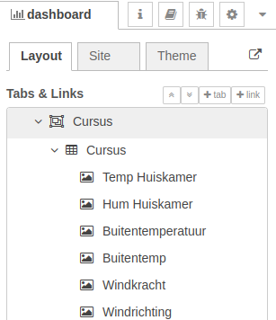 |
| 28 | Verschuif de items in de volgorde zoals je ze wilt zien. |
| 29 | Ga naar IP_adres_raspberry_pi:1880\ui om het resultaat te bekijken. ``\\`` |
|| 

### Javascript code windrichting
```
let test = msg.payload.currentConditions.winddir;
let windrichting = '';

if (test < 22.5 && test >= (360-22.5)) {
    windrichting = 'N';
} else if (test >= 325-22.5 && test <= 325+22.5) {
    windrichting = 'NW';
} else if (test >= 270-22.5 && test <= 270+22.5) {
    windrichting = 'W'
} else if (test >= 225-22.5 && test <= 225+22.5) {
    windrichting = 'ZW';
} else if (test >= 180-22.5 && test <= 180+22.5) {
    windrichting = 'Z';
} else if (test >= 135-22.5 && test <= 135+22.5) {
    windrichting = 'ZO';
} else if (test >=  90-22.5  && test <= 90+22.5) {
    windrichting = 'O';
} else if (test >=  45-22.5  && test <= 45+22.5) {
    windrichting = 'NO';
}

return { payload : windrichting };
```

Deze code doet net alsof het een windwijzer is. Het krijgt een nummer dat vertelt waar de wind vandaan komt en geeft dan een letter die past bij die richting.

Bijvoorbeeld, als de wind uit het noorden komt, zal de code de letter "N" teruggeven.

De code bekijkt het nummer om te zien welke richting het dichtstbij ligt en kiest dan de letter voor die richting. Tot slot geeft het de letter terug, zodat we die ergens anders kunnen gebruiken.


### Javascript code windsnelheid in Beaufort
```
let test = msg.payload.currentConditions.winddir;
let windsnelheid = '';

if (test <= 1) {
    windsnelheid = '0';
} else if (test > 1 && test <= 5) {
    windsnelheid = '1';
} else if (test > 5 && test <= 11) {
    windsnelheid = '2'
} else if (test > 11 && test <= 19) {
    windsnelheid = '3';
} else if (test > 19 && test <= 28) {
    windsnelheid = '4';
} else if (test > 28 && test <= 38) {
    windsnelheid = '5';
} else if (test > 38  && test <= 49) {
    windsnelheid = '6';
} else if (test > 49  && test <= 61) {
    windsnelheid = '7';
} else if (test > 61  && test <= 74) {
    windsnelheid = '8';
} else if (test > 74  && test <= 88) {
    windsnelheid = '9';
} else if (test > 88  && test <= 102) {
    windsnelheid = '10';
} else if (test > 102  && test <= 117) {
    windsnelheid = '11';
} else if (test > 117 ) {
    windsnelheid = '12';
}

return { payload : windsnelheid };
```

Deze code laat zien hoe hard de wind waait. Het krijgt een nummer dat vertelt hoe de wind waait in km/uur en geeft dan een cijfer dat past bij de kracht van de wind uitgedrukt in Beaufort.

Bijvoorbeeld, als de wind heel zachtjes waait, zal de code het cijfer "0" teruggeven. "0" beteket windstil. Als de wind heel hard waait, kan het het cijfer "12" teruggeven. "12" betekent orkaankracht. 

Tot slot geeft het dat cijfer terug, zodat we dat ergens anders kunnen gebruiken.

Hoe hard de wind waait heb ik bepaald met de gegevens uit deze [tabel](https://www.kuijntjes.nl/weer/windsnelheid.htm). 

## Samenvatting

Met Node-RED Dashboard module kun je een dashboard maken om live data te visualiseren. Het dashboard kan informatie over de temperatuur, vochtigheid en windrichting binnen en buiten tonen. Om dit te doen, heb je een Raspberry Pi 3B+ met Ubuntu Server 22.04 nodig, evenals geïnstalleerde Docker, Portainer, Node-RED en MQTT broker. Je hebt ook een ESP8266 met een DHT22-sensor nodig die gegevens naar de MQTT broker stuurt. Om het dashboard te maken, download je de Node-RED Dashboard module en stel je vervolgens het dashboard samen door de mqtt in- en gauge-nodes te slepen, de IP-adressen van de Raspberry Pi in te voeren en de juiste gegevens en namen in te voeren. Je kunt ook weergegevens van Visual Crossing ophalen met een API-sleutel en de informatie visualiseren.